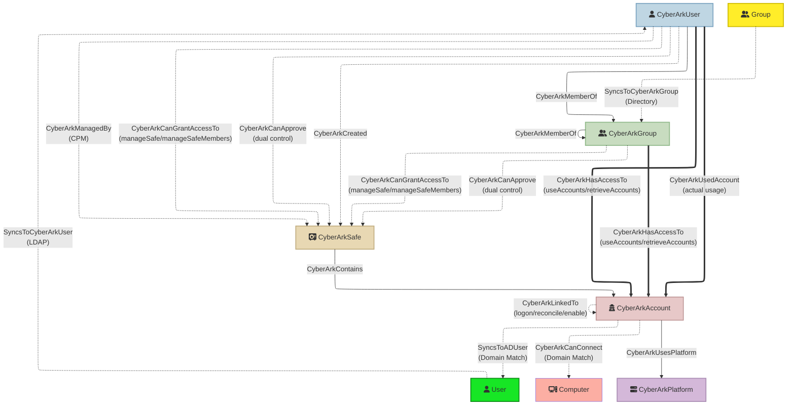

## CyberArkHound

Export CyberArk PVWA data (users, groups, safes, accounts, platforms and permissions) into a BloodHound-compatible OpenGraph JSON file for security analysis and attack path visualization.

### Quick Start

**Windows:**
```pwsh
# Download or build the binary
go build -o cyberarkhound.exe ./cmd/cyberarkhound

# Run the tool
.\cyberarkhound.exe `
    --pvwa https://pvwa.example.com `
    --username svc-bloodhound `
    --password $Env:CYBERARK_PASSWORD `
    --output cyberark_export.json `
    --target-domains corp.example.com
```

**Linux/macOS:**
```bash
# Build the binary
go build -o cyberarkhound ./cmd/cyberarkhound

# Run the tool
./cyberarkhound \
    --pvwa https://pvwa.example.com \
    --username svc-bloodhound \
    --password "$CYBERARK_PASSWORD" \
    --output cyberark_export.json \
    --target-domains corp.example.com
```

The resulting `cyberark_export.json` file can be directly imported into BloodHound.

### Features
- **High Performance**: Go implementation with concurrent processing and efficient memory usage
- **Robust API client** with exponential backoff retry logic and optional SSL customization
- **Comprehensive data extraction**: Users, groups, safes, accounts with full property sets
- **Permission-based access modeling**: Direct account access vs privilege escalation paths
- **LDAP/Directory sync tracking**: Identify synced vs local users and groups
- **External AD entity inference**: Automatic detection of relationships to Active Directory
- **Account activity tracking**: Optional CyberArkUsedAccount edges showing actual usage patterns
- **Linked account chain analysis**: Optional CyberArkLinkedTo edges mapping logon/reconcile/enable account dependencies for credential chain traversal
- **Safe creator and CPM tracking**: CyberArkCreated and CyberArkManagedBy edges showing who created and manages each safe
- **Platform-based grouping**: Optional CyberArkPlatform nodes and CyberArkUsesPlatform edges for shared attack surface analysis
- **Dual control awareness**: Per-account `requiresApproval` derived from platform Master Policy settings (with approver-presence fallback); CyberArkCanApprove edges identify who can authorize dual-controlled access
- **Enriched metadata**: Personal details, vault authorizations, safe permissions, account management status
- **Safe permission tracking**: Per-user/group safe access with permission details
- **External edges preserved**: AD sync relationships stored separately for cross-domain analysis
- **Debug logging**: Comprehensive diagnostics for troubleshooting data flow

### CyberArk User Permissions Required
To successfully ingest data from CyberArk PVWA, the API user needs specific vault authorizations, the user running this tool must have the **Audit Users** vault authorization which provides read access to all users and groups in the vault.
The users requires 'list' and 'View Safe members' permissions on all safes within CyberArk, either directly or through group membership which will allow the user to view all accounts and safes within CyberArk.

Alternativly the user can be a member of local CyberArk vault group 'Auditors', this will grant the user read only access to all safes, accounts and groups. However the permission to view the session (PSM) recordings which is not advisable

#### Recommended Setup
Create a dedicated service account for BloodHound data collection:

1. **Create Vault User**: `bloodhound-collector` (or similar)
2. **Grant Vault Authorization**: `Audit Users`
3. **Authentication Method**: CyberArk authentication (LDAP/RADIUS also supported)
4. **User Type**: EPVUser (non-LDAP) or Directory User
5. **Safe Permissions**: The user needs to be a member of all the safes in the environment or a member of a group that is a member to all the safes in CyberArk. Permissions required are 'list' and 'View Safe Members'
6. **Store this account within CyberArk**: to ensure it is rotated as per CyberArk policies
7. **Retrieve the credential using CCP/CP**: if CCP/CP is used within the environment, use this to retreive the credetial as and when required

#### What the Tool Can view
With `Audit Users` authorization, the tool can:
- ✅ List all vault users and groups
- ✅ View user group memberships

With 'list' and 'View Safe Members' on each safe, the tool can:
- ✅ List all accounts in safes (no credentials)
- ✅ List all safes in the vault
- ✅ List all safe members and their permissions
  
#### What the Tool can not do:
- ❌ **Cannot** retrieve or view account passwords
- ❌ **Cannot** modify any vault objects
- ❌ **Cannot** modify platform application settings

#### API Endpoints Used
- `POST /API/Auth/CyberArk/Logon` - Authentication
- `GET /API/safes` - List all safes
- `GET /API/Safes/{safeUrlId}/Members` - List safe members and permissions
- `GET /API/Accounts` - List accounts (filtered by safe)
- `GET /API/Accounts/{accountId}` - Get account details
- `GET /API/Accounts/{accountId}/Activities` - Get account activity logs (optional, requires `--include-activity`)
- `GET /API/Accounts/{accountId}/LinkedAccounts` - Get linked accounts: logon, reconcile, enable (optional, requires `--include-linked-accounts`)
- `GET /API/Platforms/Targets` - List target platforms (optional, requires `--include-platforms`)
- `GET /API/Users` - List all users
- `GET /API/UserGroups` - List all groups
- `GET /API/UserGroups/{groupId}` - Get group details with members
- `POST /API/Auth/Logoff` - Session cleanup

#### Security Considerations
- The `Audit Users` authorization is read-only and cannot modify vault data
- API calls do not retrieve password values
- Use a dedicated service account with long/complex password
- Rotate credentials periodically
- Monitor API usage via PVWA audit logs
- Consider IP restrictions for the service account
- Adding the user to the 'Auditors' groups is easy to provide required perms but grants too much access

### Installation

**Requirements:**
- Go 1.21 or later
- Git (for cloning the repository)

**Build from source:**
```pwsh
# Clone the repository
git clone https://github.com/jazofra/CyberArkHound
cd CyberArkHound

# Build the binary
go build -o cyberarkhound.exe ./cmd/cyberarkhound

# Or install directly to $GOPATH/bin
go install ./cmd/cyberarkhound
```

**Pre-built binaries:**
Download pre-compiled binaries from the [Releases](https://github.com/jazofra/CyberArkHound/releases) page.

### Usage

**Basic usage:**
```pwsh
.\cyberarkhound.exe `
    --pvwa https://pvwa.example.com `
    --username api_user `
    --password $Env:CYBERARK_PASSWORD `
    --output export.json `
    --target-domains corp.example.com,lab.example.com
```

**With activity tracking:**
```pwsh
.\cyberarkhound.exe `
    --pvwa https://pvwa.corp.com `
    --username svc-bloodhound `
    --password $Env:CYBERARK_PASSWORD `
    --output cyberark_export.json `
    --target-domains corp.example.com,lab.example.com `
    --include-activity `
    --activity-days 30 `
    --workers 100
```

**With debugging:**
```pwsh
.\cyberarkhound.exe `
    --pvwa https://pvwa.corp.com `
    --username svc-bloodhound `
    --password $Env:CYBERARK_PASSWORD `
    --output cyberark_export.json `
    --target-domains corp.example.com `
    --debug `
    --log-level DEBUG
```

**Performance tips for large environments:**
- Increase `--workers` to 100-200 for faster parallel processing
- Use `--log-level WARNING` to reduce logging overhead
- The tool uses efficient memory management with native goroutines for true parallelism
- Re-authentication is single-flighted: when multiple workers receive HTTP 401 simultaneously, only one re-authenticates while the others wait and reuse the refreshed token — avoiding thundering-herd token churn

### Command-Line Arguments

**Required:**
- `--pvwa` Base PVWA URL (e.g., https://pvwa.example.com)
- `--username` API username
- `--password` API password (consider using environment variable)
- `--output` Destination JSON file for BloodHound import
- `--target-domains` One or more AD domain names (comma-separated) used to link accounts to AD users

**Optional:**
- `--workers` Concurrency for parallel operations (default: 50, recommended: 100-200 for large environments)
- `--insecure` Disable SSL verification (NOT recommended for production)
- `--ca-bundle` Path to custom CA bundle for SSL verification
- `--auth-timeout` Authentication timeout in seconds (default: 360)
- `--req-timeout` Request timeout in seconds (default: 360)
- `--quiet` Suppress info/debug logs
- `--debug` Enable debug logging with detailed diagnostics
- `--log-level` Set logging level: DEBUG, INFO (default), WARNING, ERROR
- `--safe-page-limit` Safes page size for pagination (default: 1000; lower can help slow PVWA)
- `--max-reauth-attempts` Max re-authentication attempts on HTTP 401 before giving up (default: 5)

**Activity Tracking:**
- `--include-activity` Include account activity data (creates CyberArkUsedAccount edges)
- `--activity-days` Number of days to look back for activity (default: 3)
- `--activity-limit` Max activities per account to fetch from API (default: 100)

**Linked Accounts & Platforms:**
- `--include-linked-accounts` Include linked account data (creates CyberArkLinkedTo edges for logon/reconcile/enable account chains)
- `--include-platforms` Include platform data (creates CyberArkPlatform nodes and CyberArkUsesPlatform edges)

**Testing/Development:**
- `--limit-users` Limit number of users to process (0 = no limit)
- `--limit-groups` Limit number of groups to process (0 = no limit)
- `--limit-safes` Limit number of safes to process (0 = no limit)
- `--test-safe` Process only safes matching search term

### Edge Types and Permission Interpretation

The tool creates different edge types based on the permissions a user/group has on a safe:

#### CyberArkHasAccessTo (User/Group → Account)
**Direct account access** - User/group can immediately use or retrieve account credentials:
- `useAccounts`: Use accounts via PSM connections without viewing passwords
- `retrieveAccounts`: Retrieve and view account passwords

**Pattern**: When a user has these permissions on a safe, edges are created from the user directly to **each account** in that safe. This clearly shows which accounts the user can access.

**BloodHound Query Examples:**
```cypher
// Find all accounts a user can access
MATCH (u:CyberArkUser {name: "jdoe"})-[:CyberArkHasAccessTo]->(a:CyberArkAccount)
RETURN a.name

// Find all users who can access a specific account
MATCH (u:CyberArkUser)-[:CyberArkHasAccessTo]->(a:CyberArkAccount {name: "prod-db-admin"})
RETURN u.name

// Find LDAP users with direct account access
MATCH (u:CyberArkUser {isLDAPSynced: true})-[:CyberArkHasAccessTo]->(a:CyberArkAccount)
RETURN u.name, a.name
```

#### CyberArkCanGrantAccessTo (User/Group → Safe)
**Privilege escalation** - User/group can modify safe to grant themselves account access:
- `manageSafe`: Update safe properties, recover safe, delete safe
- `manageSafeMembers`: Add/remove safe members and modify their permissions

**Attack path**: A user with `manageSafeMembers` can add themselves with `retrieveAccounts`, then access all accounts in the safe. This edge points to the **safe** itself since the user must first escalate privileges before accessing accounts.

**BloodHound Query Examples:**
```cypher
// Find privilege escalation paths to accounts
MATCH (u:CyberArkUser)-[:CyberArkCanGrantAccessTo]->(s:CyberArkSafe)-[:CyberArkContains]->(a:CyberArkAccount)
RETURN u.name, s.name, a.name

// Find users who can grant themselves access to production safes
MATCH (u:CyberArkUser)-[:CyberArkCanGrantAccessTo]->(s:CyberArkSafe)
WHERE s.safeName CONTAINS "prod"
RETURN u.name, s.safeName
```

#### Edge Types Summary

| Edge | Direction | Source | Security Value |
|------|-----------|--------|----------------|
| `CyberArkHasAccessTo` | User/Group → Account | Safe member `useAccounts`/`retrieveAccounts` | Direct credential access; `requiresApproval` shows if dual control blocks retrieval |
| `CyberArkCanGrantAccessTo` | User/Group → Safe | Safe member `manageSafe`/`manageSafeMembers` | Privilege escalation — can grant themselves account access |
| `CyberArkCanApprove` | User/Group → Safe | Safe member `requestsAuthorizationLevel1`/`Level2` | Can approve dual-controlled access requests (L1/L2) |
| `CyberArkUsedAccount` | User → Account | `GET /API/Accounts/{id}/Activities` | Actual usage audit trail — who really accessed what |
| `CyberArkLinkedTo` | Account → Account | `GET /API/Accounts/{id}/LinkedAccounts` | Logon/reconcile/enable credential chains — compromising one propagates to all dependents |
| `CyberArkCreated` | User → Safe | Existing `Safe.Creator` field | Shows who created each safe (implicit ownership/access) |
| `CyberArkManagedBy` | CPM User → Safe | Existing `Safe.ManagingCPM` field | CPM accounts have privileged password management access |
| `CyberArkUsesPlatform` | Account → Platform | `GET /API/Platforms/Targets` | Shared platform config = shared attack surface |
| `CyberArkMemberOf` | User/Group → Group | Group membership data | Group-based permission inheritance |
| `CyberArkContains` | Safe → Account | Account's `safeName` field | Safe-account containment relationship |
| `SyncsToCyberArkUser` | AD User → CyberArkUser | LDAP DN with `DC=` | External edge — AD-to-CyberArk identity mapping |
| `SyncsToCyberArkGroup` | AD Group → CyberArkGroup | LDAP DN with `DC=` | External edge — AD-to-CyberArk group mapping |
| `SyncsToADUser` | CyberArkAccount → AD User | Account address matches target domain | External edge — credential-to-AD-user mapping |

**Note**: Permissions like `listAccounts`, `viewAuditLog`, `addAccounts`, `updateAccountContent` do **not** create access edges as they don't allow password retrieval or account usage.

#### CyberArkUsedAccount (User → Account) - Optional
**Actual account usage** - Tracks when users have actually retrieved or used accounts (not just permission):
- Created when `--include-activity` flag is used
- Based on CyberArk activity/audit logs via `/API/Accounts/{accountId}/Activities`
- Shows real-world account access patterns from the last 3 days (default)
- Helps identify dormant vs actively used accounts
- One edge per user-account pair (aggregates multiple activities)

**Pattern**: Edges are created from users to accounts they've actually accessed within the specified time window (`--activity-days`). Multiple activities by the same user are aggregated into a single edge showing the most recent action.

**Edge Properties**:
- `lastUsedTime`: ISO 8601 timestamp of most recent access (e.g., "2025-11-25T14:32:01+00:00")
- `lastActivity`: Most recent action performed (e.g., "CPM Verify Password", "RetrievePassword", "ShowPassword")
- `usageCount`: Total number of times this user accessed this account in the time window
- `inferred`: false (based on actual audit data)

**Technical Details**:
- Activities are filtered by Unix timestamp (Date field >= current_time - days * 86400)
- Only activities within the lookback window are processed
- If a user performed multiple actions, only the most recent is stored in `lastActivity`
- The `usageCount` reflects all qualifying activities, not just the latest one
- Parallel processing used for activity fetching (50 workers by default)

**BloodHound Query Examples:**
```cypher
// Find who actually used high-value accounts
MATCH (u:CyberArkUser)-[r:CyberArkUsedAccount]->(a:CyberArkAccount)
WHERE a.safeName CONTAINS "prod"
RETURN u.name, a.name, r.lastUsedTime, r.lastActivity, r.usageCount
ORDER BY r.lastUsedTime DESC

// Find accounts with access permissions but no actual usage (dormant/unused)
MATCH (u:CyberArkUser)-[:CyberArkHasAccessTo]->(a:CyberArkAccount)
WHERE NOT (u)-[:CyberArkUsedAccount]->(a)
RETURN u.name, a.name, a.safeName

// Find users who accessed accounts they shouldn't have permission for (privilege escalation)
MATCH (u:CyberArkUser)-[:CyberArkUsedAccount]->(a:CyberArkAccount)
WHERE NOT (u)-[:CyberArkHasAccessTo]->(a)
RETURN u.name, a.name

// Find most active users
MATCH (u:CyberArkUser)-[r:CyberArkUsedAccount]->(a:CyberArkAccount)
RETURN u.name, COUNT(a) as accountsUsed, SUM(r.usageCount) as totalAccesses
ORDER BY totalAccesses DESC
LIMIT 10
```

**Performance Note**: Activity tracking adds significant API calls (one per account). For large environments (1000+ accounts), expect:
- Additional 5-15 minutes processing time due to parallel API requests
- Default lookback is 3 days to balance recency with performance
- Use `--activity-days 7` or `--activity-days 30` for longer historical analysis
- Use `--activity-limit` to cap activities fetched per account (default: 100)
- Activity fetching runs in parallel (50 threads) for optimal performance
- Can be run separately from initial data collection for incremental updates

#### Dual Control (Access Confirmation) Awareness
CyberArk's dual control feature requires users to get approval from authorized Safe members before retrieving passwords. CyberArkHound determines dual control status using a combination of platform policy data and safe member permissions.

**How CyberArk Dual Control works:**

Dual control is governed by the **Master Policy** rule "Require dual control password access approval", which can be set globally or overridden per platform. The effective policy for each platform is exposed via the `GET /API/Platforms/` endpoint in the `privilegedAccessWorkflows.requireDualControlPasswordAccessApproval` field. Safe members with `requestsAuthorizationLevel1` or `requestsAuthorizationLevel2` permissions act as the **approvers** who confirm or reject access requests.

**How CyberArkHound determines `requiresApproval`:**

The `requiresApproval` property on `CyberArkHasAccessTo` edges is computed **per-account** using a layered approach:

| Layer | Source | Check |
|-------|--------|-------|
| 1. Platform policy (primary) | `GET /API/Platforms/` → `requireDualControlPasswordAccessApproval` | Is dual control enabled for the account's platform in the effective Master Policy? |
| 2. Approver presence (enforcement) | Safe member permissions → `requestsAuthorizationLevel1` / `Level2` | Does the safe have at least one member who can approve requests? Without approvers, dual control is unenforceable even if the policy enables it. |
| 3. Member bypass | Safe member permissions → `accessWithoutConfirmation` | Can this specific member bypass dual control? If `true`, `requiresApproval` is always `false`. |

An account's `requiresApproval` is `true` only when **all three conditions** are met:
1. The account's platform has `requireDualControlPasswordAccessApproval: true`
2. The safe has at least one member with L1/L2 approval permissions
3. The accessing member does **not** have `accessWithoutConfirmation: true`

**Fallback when platform data is unavailable:**
When `--include-platforms` is not used, the platform policy cannot be checked. In this case, CyberArkHound falls back to an **approver-presence heuristic**: if the safe has members with L1/L2 approval permissions, dual control is assumed to be active. This can produce false positives (e.g., approver permissions exist from a template but the Master Policy has dual control disabled). Use `--include-platforms` for accurate dual control detection.

**CyberArk safe member permissions used:**

| Permission | Type | Role |
|------------|------|------|
| `accessWithoutConfirmation` | bool | Member can bypass dual control and retrieve passwords without approval |
| `requestsAuthorizationLevel1` | bool | Member can approve Level 1 access requests from other users |
| `requestsAuthorizationLevel2` | bool | Member can approve Level 2 access requests from other users |

**Platform policy field used (requires `--include-platforms`):**

| Field | Source | Meaning |
|-------|--------|---------|
| `requireDualControlPasswordAccessApproval` | `GET /API/Platforms/` → `privilegedAccessWorkflows` | The effective Master Policy setting for this platform, including any platform-level exceptions |

**Edge Properties on CyberArkHasAccessTo:**
- `requiresApproval`: `true` if the member needs approval from a dual control authorizer before retrieving passwords

**CyberArkCanApprove Edge Properties:**
- `approvalLevel`: Authorization level (1 or 2) — maps to `requestsAuthorizationLevel1` / `requestsAuthorizationLevel2` permissions

**BloodHound Query Examples:**
```cypher
// Users who can retrieve passwords WITHOUT any approval (highest risk)
MATCH (u:CyberArkUser)-[r:CyberArkHasAccessTo {requiresApproval: false}]->(a:CyberArkAccount)
RETURN u.name, a.name, a.safeName

// Users who REQUIRE approval — attack needs both accessor + approver
MATCH (u:CyberArkUser)-[r:CyberArkHasAccessTo {requiresApproval: true}]->(a:CyberArkAccount)
RETURN u.name, a.name, a.safeName

// Find approvers who can unlock access for dual-controlled safes
MATCH (approver)-[r:CyberArkCanApprove]->(s:CyberArkSafe)-[:CyberArkContains]->(a:CyberArkAccount)
RETURN approver.name, r.approvalLevel, s.safeName, COLLECT(a.name)

// Full dual control attack path: need BOTH a user with access AND an approver
MATCH (u:CyberArkUser)-[access:CyberArkHasAccessTo {requiresApproval: true}]->(a:CyberArkAccount)
MATCH (a)<-[:CyberArkContains]-(s:CyberArkSafe)<-[approve:CyberArkCanApprove]-(approver)
RETURN u.name AS accessor, a.name AS account, approver.name AS approver, approve.approvalLevel

// Users who are BOTH accessor and approver on the same safe (dual control bypass risk)
MATCH (u)-[access:CyberArkHasAccessTo {requiresApproval: true}]->(a:CyberArkAccount)
MATCH (a)<-[:CyberArkContains]-(s:CyberArkSafe)<-[:CyberArkCanApprove]-(u)
RETURN u.name, s.safeName, COLLECT(a.name) AS selfApprovableAccounts

// Find platforms where dual control is enabled
MATCH (p:CyberArkPlatform {requireDualControlPasswordAccessApproval: true})
RETURN p.name, p.systemType

// Accounts on dual-control platforms but in safes without approvers (policy misconfiguration)
MATCH (a:CyberArkAccount)-[:CyberArkUsesPlatform]->(p:CyberArkPlatform {requireDualControlPasswordAccessApproval: true})
MATCH (s:CyberArkSafe)-[:CyberArkContains]->(a)
WHERE NOT ()-[:CyberArkCanApprove]->(s)
RETURN a.name, s.safeName, p.name AS platform
```

#### CyberArkLinkedTo (Account → Account) - Optional
**Linked account dependencies** - Maps credential chains where one account depends on another for logon, reconciliation, or enablement:
- Created when `--include-linked-accounts` flag is used
- Based on CyberArk linked accounts via `/API/Accounts/{accountId}/LinkedAccounts`
- Link types: `logon` (ExtraPassID=1), `enable` (ExtraPassID=2), `reconcile` (ExtraPassID=3)
- Critical for attack path analysis: compromising a logon account gives access to all accounts that depend on it

**Edge Properties**:
- `linkType`: Type of link — `logon`, `enable`, `reconcile`, or `unknown`
- `linkName`: Name of the linked account relationship
- `safeName`: Safe containing the linked account

**BloodHound Query Examples:**
```cypher
// Find all accounts that depend on a specific logon account
MATCH (logon:CyberArkAccount {name: "svc-logon"})<-[r:CyberArkLinkedTo {linkType: "logon"}]-(a:CyberArkAccount)
RETURN a.name, a.safeName

// Find credential chains: accounts linked through logon accounts
MATCH path = (a:CyberArkAccount)-[:CyberArkLinkedTo*1..3]->(target:CyberArkAccount)
RETURN path

// Find all reconcile account dependencies
MATCH (a:CyberArkAccount)-[r:CyberArkLinkedTo {linkType: "reconcile"}]->(reconciler:CyberArkAccount)
RETURN a.name, reconciler.name, reconciler.safeName

// Attack path: user with access to a logon account can reach all dependent accounts
MATCH (u:CyberArkUser)-[:CyberArkHasAccessTo]->(logon:CyberArkAccount)<-[:CyberArkLinkedTo {linkType: "logon"}]-(dependent:CyberArkAccount)
RETURN u.name, logon.name, COLLECT(dependent.name) as dependentAccounts
```

**Performance Note**: Linked account fetching adds one API call per account. Runs in parallel (50 workers by default).

#### CyberArkCreated (User → Safe)
**Safe creator relationship** - Shows which user created each safe:
- Always emitted (no extra API calls — uses existing `Safe.Creator` field)
- Useful for understanding implicit access and ownership

**Edge Properties**:
- `creatorId`: The vault user ID of the creator

**BloodHound Query Examples:**
```cypher
// Find all safes created by a user
MATCH (u:CyberArkUser)-[:CyberArkCreated]->(s:CyberArkSafe)
RETURN u.name, s.safeName

// Find who created production safes
MATCH (u:CyberArkUser)-[:CyberArkCreated]->(s:CyberArkSafe)
WHERE s.safeName CONTAINS "prod"
RETURN u.name, s.safeName

// Find users who created safes AND can grant access to them
MATCH (u:CyberArkUser)-[:CyberArkCreated]->(s:CyberArkSafe)
WHERE (u)-[:CyberArkCanGrantAccessTo]->(s)
RETURN u.name, s.safeName
```

#### CyberArkManagedBy (CPM User → Safe)
**CPM management relationship** - Shows which CPM component manages password rotation for each safe:
- Always emitted (no extra API calls — uses existing `Safe.ManagingCPM` field)
- CPM accounts have privileged access to manage and rotate passwords

**BloodHound Query Examples:**
```cypher
// Find all safes managed by a specific CPM
MATCH (cpm:CyberArkUser)-[:CyberArkManagedBy]->(s:CyberArkSafe)
WHERE cpm.name CONTAINS "CPM"
RETURN cpm.name, COLLECT(s.safeName) as managedSafes

// Find safes without CPM management (unmanaged passwords)
MATCH (s:CyberArkSafe)
WHERE NOT ()-[:CyberArkManagedBy]->(s)
RETURN s.safeName

// Find all accounts reachable through a CPM's managed safes
MATCH (cpm:CyberArkUser)-[:CyberArkManagedBy]->(s:CyberArkSafe)-[:CyberArkContains]->(a:CyberArkAccount)
RETURN cpm.name, COUNT(a) as accountCount
```

#### CyberArkUsesPlatform (Account → Platform) - Optional
**Platform association** - Shows which platform configuration each account uses:
- Created when `--include-platforms` flag is used
- Creates `CyberArkPlatform` nodes from `/API/Platforms/Targets`
- Accounts sharing a platform share configuration, policies, and potential vulnerabilities

**BloodHound Query Examples:**
```cypher
// Find all accounts using a specific platform
MATCH (a:CyberArkAccount)-[:CyberArkUsesPlatform]->(p:CyberArkPlatform {name: "WinServerLocal"})
RETURN a.name, a.safeName

// Find platforms with the most accounts (highest blast radius)
MATCH (a:CyberArkAccount)-[:CyberArkUsesPlatform]->(p:CyberArkPlatform)
RETURN p.name, p.systemType, COUNT(a) as accountCount
ORDER BY accountCount DESC

// Find inactive platforms still in use
MATCH (a:CyberArkAccount)-[:CyberArkUsesPlatform]->(p:CyberArkPlatform {active: false})
RETURN p.name, COUNT(a) as accountsOnInactivePlatform
```

### Node Properties

#### CyberArkUser Properties
- **Identity**: `userId`, `name`, `userType`, `source`, `isLDAPSynced`
- **Status**: `enabled`, `suspended`, `componentUser`
- **Authentication**: `allowedAuthenticationMethods`, `vaultAuthorization`
- **Directory**: `distinguishedName`, `location`, `authorizedInterfaces`
- **Personal Details**: `firstName`, `lastName`, `email`, `businessEmail`, `businessPhone`, `mobilePhone`, `title`, `organization`, `department`, `profession`, `address` (street, city, state, zip, country)
- **Memberships**: `groupsMembership` (list of group names)
- **Permissions**: `safePermissions` (JSON array with safeName, permissions, hasDirectAccess, canGrantAccess)

#### CyberArkGroup Properties
- **Identity**: `groupId`, `name`, `groupType`, `isDirectorySynced`
- **Directory**: `directory`, `distinguishedName`, `location`
- **Metadata**: `description`, `memberCount`
- **Members**: `members` (list of usernames)
- **Permissions**: `safePermissions` (JSON array with safe access details)

#### CyberArkSafe Properties
- **Identity**: `safeName`, `safeUrlId`, `safeNumber`
- **Metadata**: `description`, `location`, `creator`
- **CPM**: `managingCPM`, `olacEnabled`
- **Retention**: `numberOfVersionsRetention`, `numberOfDaysRetention`, `autoPurgeEnabled`
- **Timestamps**: `creationTime`, `lastModificationTime`
- **Settings**: `isExpiredMembershipEnable`

#### CyberArkAccount Properties
- **Identity**: `accountId`, `userName`, `platformId`, `address`
- **BloodHound name**: `name` (set to `userName` to avoid collisions with AD user names in OpenGraph matching)
- **Safe**: `safeName`, `safeUrlId`
- **Status**: `status`, `enabled`, `secretType`
- **Management**: `automaticManagementEnabled`, `manualManagementReason`
- **Timestamps**: `createdTime`, `lastModifiedTime`, `lastVerifiedTime`, `lastReconciledTime`, `categoryModificationTime`
- **CPM**: `lastModifiedBy`
- **Extended**: `platformAccountProperties` (JSON), `secretManagement` (JSON)

#### CyberArkPlatform Properties (requires `--include-platforms`)
- **Identity**: `platformId`, `name`
- **Configuration**: `systemType`, `active`
- **Metadata**: `description`

### Output
The resulting JSON structure follows BloodHound OpenGraph schema:

Note: CyberArk node `id` values are namespaced with a 4-character PVWA tag derived from `--pvwa` (e.g., `causer-jdoe-APVA`) to avoid collisions when ingesting multiple PVWA instances.
```json
{
  "metadata": {
    "source_kind": "CyberArkBase"
  },
  "graph": {
    "nodes": [
      {
        "id": "causer-jdoe-APVA",
        "kinds": ["CyberArkUser", "CyberArkBase"],
        "properties": {
          "name": "jdoe",
          "isLDAPSynced": true,
          "vaultAuthorization": "[\"Audit Users\", \"Safe Managers\"]",
          "safePermissions": "[{\"safeName\":\"Production\",\"permissions\":[\"useAccounts\",\"retrieveAccounts\"],\"hasDirectAccess\":true}]",
          "email": "jdoe@corp.com",
          "department": "IT Security"
        }
      },
      {
        "id": "caaccount-12345-APVA",
        "kinds": ["CyberArkAccount", "CyberArkBase"],
        "properties": {
          "name": "prod-db-admin",
          "platformId": "WinServerLocal",
          "address": "prod-sql-01.corp.com",
          "safeName": "Production",
          "automaticManagementEnabled": true
        }
      }
    ],
    "edges": [
      {
        "kind": "CyberArkHasAccessTo",
        "start": "causer-jdoe-APVA",
        "end": "caaccount-12345-APVA",
        "properties": {
          "matchedPermissionNames": ["useAccounts", "retrieveAccounts"],
          "via": "casafe-Production-APVA",
          "viaSafeName": "Production"
        }
      }
    ]
  }
}
```

**External edges** (AD sync relationships) are included in the same structure with `match_by` metadata for cross-domain correlation.
```json
{
	"metadata": { "source_kind": "CyberArkBase" },
	"graph": {
		"nodes": [ { "id": "...", "kinds": ["CyberArkUser"], "properties": {"name": "..."} } ],
		"edges": [ { "kind": "CyberArkHasAccessTo", "start": {"value": "...", "match_by": "id"}, "end": {"value": "...", "match_by": "id"} } ]
	}
}
```
External edges (SyncsToCyberArkUser / SyncsToCyberArkGroup / SyncsToADUser / CyberArkCanConnect) are included with `match_by` set to `name` where appropriate.

### Data Flow Diagram
High-level relationship visualization between CyberArk entities and inferred external AD objects:



**Legend:**
- **Solid Lines** (→): Internal CyberArk relationships (membership, containment, platform)
- **Thick Lines** (⇒): Direct account access edges (permission-based or actual usage)
- **Dashed Lines** (⇢): External sync relationships, privilege escalation, dual control approval, linked accounts, creator/CPM management

### BloodHound Custom Node Definitions
The file `cyberark_model.json` defines custom node types (icons & colors) for BloodHound via the API Explorer `custom-nodes` endpoint:

```json
{
	"custom_types": {
		"CyberArkAccount":  {"icon": {"type": "font-awesome", "name": "user-secret", "color": "#E7C8C8"}},
		"CyberArkGroup":    {"icon": {"type": "font-awesome", "name": "user-group",  "color": "#C8DCC0"}},
		"CyberArkSafe":     {"icon": {"type": "font-awesome", "name": "vault",       "color": "#E8D8B3"}},
		"CyberArkUser":     {"icon": {"type": "font-awesome", "name": "user",        "color": "#BFD6E3"}},
		"CyberArkPlatform": {"icon": {"type": "font-awesome", "name": "server",      "color": "#D4B8D9"}}
	}
}
```

#### Applying Custom Types
Use the BloodHound API (adjust host & auth):
```pwsh
curl -X POST -H "Content-Type: application/json" -d @cyberark_model.json https://bloodhound.example.com/api/custom-nodes
```
Or place/merge into your existing customization workflow before ingesting the exported graph.

After loading, BloodHound will render CyberArk nodes with meaningful icons/colors matching the diagram above.

#### Maintaining
- Extend with additional CyberArk-derived types by adding entries under `custom_types`.
- Keep color palette distinct for rapid visual triage (avoid near-duplicate hex codes).
- Version the file if distributing across teams (e.g., `cyberark_model.v1.json`).

### Logging and Verbosity Control

The tool provides flexible logging control to balance visibility with output volume:

#### Log Levels
Use `--log-level` to control progress reporting frequency:

**WARNING/ERROR** - Minimal output, only critical messages:
```pwsh
.\cyberarkhound.exe --pvwa ... --log-level WARNING --output export.json --target-domains corp.com
```
- Shows start/end of major phases
- No intermediate progress updates
- Best for automated/scheduled runs

**INFO** (default) - Balanced progress updates:
```pwsh
.\cyberarkhound.exe --pvwa ... --log-level INFO --output export.json --target-domains corp.com
```
- Progress every 50 users/groups
- Progress every 20 safes
- Progress every 100 accounts/members
- Progress every 100 nodes during export
- Progress every 500 edges during export
- Recommended for interactive runs

**DEBUG** - Detailed progress for troubleshooting:
```pwsh
.\cyberarkhound.exe --pvwa ... --log-level DEBUG --output export.json --target-domains corp.com
```
- Progress every 10 users/groups
- Progress every 5 safes
- Progress every 25 accounts/members/nodes
- Progress every 100 edges
- Additional diagnostic information
- Best for troubleshooting or understanding processing flow

#### Additional Logging Options
- `--quiet` - Suppress most logging (overrides log-level)
- `--debug` - Enable permission analysis diagnostics

#### Example Output (INFO level)
```
[2025-11-24 10:15:23] INFO cyberarkhound: Processing 500 users...
[2025-11-24 10:15:24] INFO cyberarkhound:   Processed 50/500 users (10.0%)
[2025-11-24 10:15:25] INFO cyberarkhound:   Processed 100/500 users (20.0%)
...
[2025-11-24 10:15:30] INFO cyberarkhound:   Processed 500/500 users (100.0%)
[2025-11-24 10:15:30] INFO cyberarkhound: Processing 3000 accounts...
[2025-11-24 10:15:35] INFO cyberarkhound:   Processed 100/3000 accounts (3.3%)
...
[2025-11-24 10:16:45] INFO cyberarkhound: === Collection Summary ===
[2025-11-24 10:16:45] INFO cyberarkhound: Total Nodes: 3780
[2025-11-24 10:16:45] INFO cyberarkhound: Nodes by Type:
[2025-11-24 10:16:45] INFO cyberarkhound:   CyberArkUser: 500
[2025-11-24 10:16:45] INFO cyberarkhound:   CyberArkGroup: 80
[2025-11-24 10:16:45] INFO cyberarkhound:   CyberArkSafe: 150
[2025-11-24 10:16:45] INFO cyberarkhound:   CyberArkAccount: 3000
[2025-11-24 10:16:45] INFO cyberarkhound:   CyberArkPlatform: 50
[2025-11-24 10:16:45] INFO cyberarkhound: Total Internal Edges: 12350
[2025-11-24 10:16:45] INFO cyberarkhound: Internal Edges by Type:
[2025-11-24 10:16:45] INFO cyberarkhound:   CyberArkMemberOf: 620
[2025-11-24 10:16:45] INFO cyberarkhound:   CyberArkContains: 3000
[2025-11-24 10:16:45] INFO cyberarkhound:   CyberArkHasAccessTo: 4200
[2025-11-24 10:16:45] INFO cyberarkhound:   CyberArkCanGrantAccessTo: 310
[2025-11-24 10:16:45] INFO cyberarkhound:   CyberArkCanApprove: 95
[2025-11-24 10:16:45] INFO cyberarkhound:   CyberArkCreated: 150
[2025-11-24 10:16:45] INFO cyberarkhound:   CyberArkManagedBy: 140
[2025-11-24 10:16:45] INFO cyberarkhound:   CyberArkUsedAccount: 785
[2025-11-24 10:16:45] INFO cyberarkhound:   CyberArkLinkedTo: 2100
[2025-11-24 10:16:45] INFO cyberarkhound:   CyberArkUsesPlatform: 950
[2025-11-24 10:16:45] INFO cyberarkhound: Total External Edges: 1680
[2025-11-24 10:16:45] INFO cyberarkhound: External Edges by Type:
[2025-11-24 10:16:45] INFO cyberarkhound:   SyncsToCyberArkUser: 480
[2025-11-24 10:16:45] INFO cyberarkhound:   SyncsToCyberArkGroup: 60
[2025-11-24 10:16:45] INFO cyberarkhound:   SyncsToADUser: 1140
[2025-11-24 10:16:45] INFO cyberarkhound: Memory stats: Alloc=85MB Sys=142MB NumGC=12
[2025-11-24 10:16:45] INFO cyberarkhound: Writing JSON to file: export.json
[2025-11-24 10:16:45] INFO cyberarkhound:   Writing compact JSON format...
[2025-11-24 10:16:48] INFO cyberarkhound: Export complete! File written successfully.
```

#### Performance Tips
- Use `--log-level WARNING` for large environments (10K+ objects) to minimize logging overhead
- Use `--log-level DEBUG` only when investigating specific issues
- Progress updates have minimal performance impact but can fill log files in very large environments
- Compact JSON format is always used (no pretty-printing) for optimal write performance

### Development
Module layout:
```
cmd/cyberarkhound/
    main.go            # CLI entry point / orchestration
pkg/
    client/
        client.go      # CyberArk PVWA API client
    models/
        models.go      # Data structures for API responses
    graph/
        builder.go     # OpenGraph construction
        pvwa_tag.go    # PVWA URL tagging algorithm
        utils.go       # Graph utilities, permission maps
    exporter/
        exporter.go    # BloodHound JSON export
```

### Extending
Add new edge types or property mappings inside `pkg/graph/builder.go`. Keep transformations pure and avoid network calls there. For additional export formats create a new package (e.g. `pkg/neo4j/exporter.go`) and reuse the existing OpenGraph object.

### Security Notes
- Prefer supplying credentials via environment variables or a secure secret store.
- Avoid `--insecure` outside of controlled test environments.
- Validate custom CA bundle integrity before use.

### Contributing
1. Fork and create feature branch
2. Add tests or minimal repro script if introducing complex logic
3. Keep changes small and focused; update README where behavior changes
4. Submit PR describing rationale and any edge cases

### Support

Open issues for bugs or enhancement requests.

## Acknowledgments
Thank you to Siemens Healthineers for supporting this research and to my coworkers who have helped with its development.

- Julian Garcia - for cooperating with this research, and for offering valuable perspective for coding practices.


