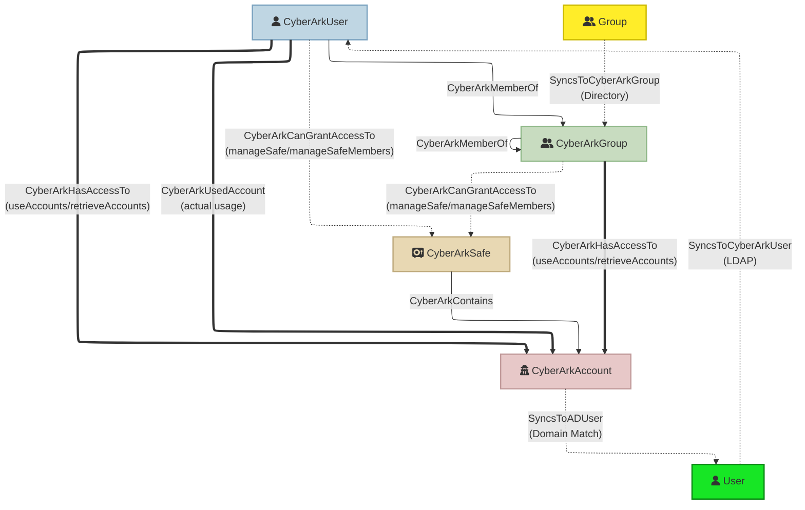

## CyberArkHound

Export CyberArk PVWA data (users, groups, safes, accounts and permissions) into a BloodHound-compatible OpenGraph JSON file for security analysis and attack path visualization.

**🚀 Now available in Go!** The Go implementation offers significantly better performance (5-10x faster) with lower memory usage, making it ideal for large CyberArk environments.

### Quick Start (Go Version)

**Windows:**
```pwsh
# Download or build the binary
go build -o cyberarkhound.exe ./cmd/cyberarkhound

# Run the tool
.\cyberarkhound.exe `
    --pvwa https://pvwa.example.com `
    --username svc-bloodhound `
    --password $Env:CYBERARK_PASSWORD `
    --output cyberark_export.json `
    --target-domains corp.example.com
```

**Linux/macOS:**
```bash
# Build the binary
go build -o cyberarkhound ./cmd/cyberarkhound

# Run the tool
./cyberarkhound \
    --pvwa https://pvwa.example.com \
    --username svc-bloodhound \
    --password "$CYBERARK_PASSWORD" \
    --output cyberark_export.json \
    --target-domains corp.example.com
```

The resulting `cyberark_export.json` file can be directly imported into BloodHound.

### Features
- **High Performance**: Go implementation with concurrent processing and efficient memory usage
- **Robust API client** with exponential backoff retry logic and optional SSL customization
- **Comprehensive data extraction**: Users, groups, safes, accounts with full property sets
- **Permission-based access modeling**: Direct account access vs privilege escalation paths
- **LDAP/Directory sync tracking**: Identify synced vs local users and groups
- **External AD entity inference**: Automatic detection of relationships to Active Directory
- **Account activity tracking**: Optional CyberArkUsedAccount edges showing actual usage patterns
- **Enriched metadata**: Personal details, vault authorizations, safe permissions, account management status
- **Safe permission tracking**: Per-user/group safe access with permission details
- **External edges preserved**: AD sync relationships stored separately for cross-domain analysis
- **Debug logging**: Comprehensive diagnostics for troubleshooting data flow

### CyberArk User Permissions Required
To successfully ingest data from CyberArk PVWA, the API user needs specific vault authorizations:
The user running this tool must have the **Audit Users** vault authorization. This built-in authorization grants:
- Read access to all users and groups in the vault
- Read access to all safes and their members
- Read access to all accounts (without retrieving passwords)
- View safe member permissions

#### Recommended Setup
Create a dedicated service account for BloodHound data collection:

1. **Create Vault User**: `bloodhound-collector` (or similar)
2. **Grant Vault Authorization**: `Audit Users`
3. **Authentication Method**: CyberArk authentication (LDAP/RADIUS also supported)
4. **User Type**: EPVUser (non-LDAP) or Directory User

#### What the Tool Can Access
With `Audit Users` authorization, the tool can:
- ✅ List all safes in the vault
- ✅ List all safe members and their permissions
- ✅ List all accounts in safes (metadata only)
- ✅ List all vault users and groups
- ✅ View user group memberships
- ❌ **Cannot** retrieve or view account passwords
- ❌ **Cannot** modify any vault objects

#### API Endpoints Used
- `POST /API/Auth/CyberArk/Logon` - Authentication
- `GET /API/safes` - List all safes
- `GET /API/Safes/{safeUrlId}/Members` - List safe members and permissions
- `GET /API/Accounts` - List accounts (filtered by safe)
- `GET /API/Accounts/{accountId}` - Get account details
- `GET /API/Accounts/{accountId}/Activities` - Get account activity logs (optional, requires `--include-activity`)
- `GET /API/Users` - List all users
- `GET /API/UserGroups` - List all groups
- `GET /API/UserGroups/{groupId}` - Get group details with members
- `POST /API/Auth/Logoff` - Session cleanup

#### Security Considerations
- The `Audit Users` authorization is read-only and cannot modify vault data
- API calls do not retrieve password values
- Use a dedicated service account with long/complex password
- Rotate credentials periodically
- Monitor API usage via PVWA audit logs
- Consider IP restrictions for the service account

### Installation

#### Go Version (Recommended)

**Requirements:**
- Go 1.21 or later
- Git (for cloning the repository)

**Build from source:**
```pwsh
# Clone the repository
git clone https://github.com/jazofra/CyberArkHound
cd CyberArkHound

# Build the binary
go build -o cyberarkhound.exe ./cmd/cyberarkhound

# Or install directly to $GOPATH/bin
go install ./cmd/cyberarkhound
```

**Pre-built binaries:**
Download pre-compiled binaries from the [Releases](https://github.com/jazofra/CyberArkHound/releases) page.

#### Python Version (Legacy)

Create and activate a virtual environment (recommended) then install dependencies:
```pwsh
python -m venv .venv
.venv\Scripts\Activate.ps1
pip install -r requirements.txt
```

### Usage

#### Go Version (Recommended)

The Go implementation offers significantly better performance and is the recommended option for production use.

**Basic usage:**
```pwsh
.\cyberarkhound.exe `
    --pvwa https://pvwa.example.com `
    --username api_user `
    --password $Env:CYBERARK_PASSWORD `
    --output export.json `
    --target-domains corp.example.com,lab.example.com
```

**With activity tracking:**
```pwsh
.\cyberarkhound.exe `
    --pvwa https://pvwa.corp.com `
    --username svc-bloodhound `
    --password $Env:CYBERARK_PASSWORD `
    --output cyberark_export.json `
    --target-domains corp.example.com,lab.example.com `
    --include-activity `
    --activity-days 30 `
    --workers 100
```

**With debugging:**
```pwsh
.\cyberarkhound.exe `
    --pvwa https://pvwa.corp.com `
    --username svc-bloodhound `
    --password $Env:CYBERARK_PASSWORD `
    --output cyberark_export.json `
    --target-domains corp.example.com `
    --debug `
    --log-level DEBUG
```

**Performance tips for large environments:**
- Increase `--workers` to 100-200 for faster parallel processing
- Use `--log-level WARNING` to reduce logging overhead
- Allocate sufficient memory (Go typically uses 50-70% less than Python)

#### Python Version (Legacy)

Run the modular CLI:
```pwsh
python -m cyberarkhound.cli `
	--pvwa https://pvwa.example.com `
	--username api_user `
	--password $Env:CYBERARK_PASSWORD `
	--output export.json `
	--target-domains corp.example.com lab.example.com
```

Legacy one-file entry point:
```pwsh
python CyberArkHound.py --help
```

### Command-Line Arguments

**Required:**
- `--pvwa` Base PVWA URL (e.g., https://pvwa.example.com)
- `--username` API username
- `--password` API password (consider using environment variable)
- `--output` Destination JSON file for BloodHound import
- `--target-domains` One or more AD domain names (comma-separated) used to link accounts to AD users

**Optional:**
- `--workers` Concurrency for parallel operations (default: 50, recommended: 100-200 for large environments)
- `--insecure` Disable SSL verification (NOT recommended for production)
- `--ca-bundle` Path to custom CA bundle for SSL verification
- `--auth-timeout` Authentication timeout in seconds (default: 360)
- `--req-timeout` Request timeout in seconds (default: 360)
- `--quiet` Suppress info/debug logs
- `--debug` Enable debug logging with detailed diagnostics
- `--log-level` Set logging level: DEBUG, INFO (default), WARNING, ERROR

**Activity Tracking:**
- `--include-activity` Include account activity data (creates CyberArkUsedAccount edges)
- `--activity-days` Number of days to look back for activity (default: 3)
- `--activity-limit` Max activities per account to fetch from API (default: 100)

**Testing/Development:**
- `--limit-users` Limit number of users to process (0 = no limit)
- `--limit-groups` Limit number of groups to process (0 = no limit)
- `--limit-safes` Limit number of safes to process (0 = no limit)
- `--test-safe` Process only safes matching search term

### Edge Types and Permission Interpretation

The tool creates different edge types based on the permissions a user/group has on a safe:

#### CyberArkHasAccessTo (User/Group → Account)
**Direct account access** - User/group can immediately use or retrieve account credentials:
- `useAccounts`: Use accounts via PSM connections without viewing passwords
- `retrieveAccounts`: Retrieve and view account passwords

**Pattern**: When a user has these permissions on a safe, edges are created from the user directly to **each account** in that safe. This clearly shows which accounts the user can access.

**BloodHound Query Examples:**
```cypher
// Find all accounts a user can access
MATCH (u:CyberArkUser {name: "jdoe"})-[:CyberArkHasAccessTo]->(a:CyberArkAccount)
RETURN a.name

// Find all users who can access a specific account
MATCH (u:CyberArkUser)-[:CyberArkHasAccessTo]->(a:CyberArkAccount {name: "prod-db-admin"})
RETURN u.name

// Find LDAP users with direct account access
MATCH (u:CyberArkUser {isLDAPSynced: true})-[:CyberArkHasAccessTo]->(a:CyberArkAccount)
RETURN u.name, a.name
```

#### CyberArkCanGrantAccessTo (User/Group → Safe)
**Privilege escalation** - User/group can modify safe to grant themselves account access:
- `manageSafe`: Update safe properties, recover safe, delete safe
- `manageSafeMembers`: Add/remove safe members and modify their permissions

**Attack path**: A user with `manageSafeMembers` can add themselves with `retrieveAccounts`, then access all accounts in the safe. This edge points to the **safe** itself since the user must first escalate privileges before accessing accounts.

**BloodHound Query Examples:**
```cypher
// Find privilege escalation paths to accounts
MATCH (u:CyberArkUser)-[:CyberArkCanGrantAccessTo]->(s:CyberArkSafe)-[:CyberArkContains]->(a:CyberArkAccount)
RETURN u.name, s.name, a.name

// Find users who can grant themselves access to production safes
MATCH (u:CyberArkUser)-[:CyberArkCanGrantAccessTo]->(s:CyberArkSafe)
WHERE s.safeName CONTAINS "prod"
RETURN u.name, s.safeName
```

#### Other Edge Types
- `CyberArkMemberOf`: User is member of a group
- `CyberArkContains` (Safe → Account): Safe contains an account
- `CyberArkUsedAccount` (User → Account): User has actively used/retrieved account (requires `--include-activity`)
- `SyncsToCyberArkUser`: AD User syncs to CyberArk User (external edge)
- `SyncsToCyberArkGroup`: AD Group syncs to CyberArk Group (external edge)
- `SyncsToADUser`: CyberArk Account syncs to AD User (external edge)

**Note**: Permissions like `listAccounts`, `viewAuditLog`, `addAccounts`, `updateAccountContent` do **not** create access edges as they don't allow password retrieval or account usage.

#### CyberArkUsedAccount (User → Account) - Optional
**Actual account usage** - Tracks when users have actually retrieved or used accounts (not just permission):
- Created when `--include-activity` flag is used
- Based on CyberArk activity/audit logs via `/API/Accounts/{accountId}/Activities`
- Shows real-world account access patterns from the last 3 days (default)
- Helps identify dormant vs actively used accounts
- One edge per user-account pair (aggregates multiple activities)

**Pattern**: Edges are created from users to accounts they've actually accessed within the specified time window (`--activity-days`). Multiple activities by the same user are aggregated into a single edge showing the most recent action.

**Edge Properties**:
- `lastUsedTime`: ISO 8601 timestamp of most recent access (e.g., "2025-11-25T14:32:01+00:00")
- `lastActivity`: Most recent action performed (e.g., "CPM Verify Password", "RetrievePassword", "ShowPassword")
- `usageCount`: Total number of times this user accessed this account in the time window
- `inferred`: false (based on actual audit data)

**Technical Details**:
- Activities are filtered by Unix timestamp (Date field >= current_time - days * 86400)
- Only activities within the lookback window are processed
- If a user performed multiple actions, only the most recent is stored in `lastActivity`
- The `usageCount` reflects all qualifying activities, not just the latest one
- Parallel processing used for activity fetching (50 workers by default)

**BloodHound Query Examples:**
```cypher
// Find who actually used high-value accounts
MATCH (u:CyberArkUser)-[r:CyberArkUsedAccount]->(a:CyberArkAccount)
WHERE a.safeName CONTAINS "prod"
RETURN u.name, a.name, r.lastUsedTime, r.lastActivity, r.usageCount
ORDER BY r.lastUsedTime DESC

// Find accounts with access permissions but no actual usage (dormant/unused)
MATCH (u:CyberArkUser)-[:CyberArkHasAccessTo]->(a:CyberArkAccount)
WHERE NOT (u)-[:CyberArkUsedAccount]->(a)
RETURN u.name, a.name, a.safeName

// Find users who accessed accounts they shouldn't have permission for (privilege escalation)
MATCH (u:CyberArkUser)-[:CyberArkUsedAccount]->(a:CyberArkAccount)
WHERE NOT (u)-[:CyberArkHasAccessTo]->(a)
RETURN u.name, a.name

// Find most active users
MATCH (u:CyberArkUser)-[r:CyberArkUsedAccount]->(a:CyberArkAccount)
RETURN u.name, COUNT(a) as accountsUsed, SUM(r.usageCount) as totalAccesses
ORDER BY totalAccesses DESC
LIMIT 10
```

**Performance Note**: Activity tracking adds significant API calls (one per account). For large environments (1000+ accounts), expect:
- Additional 5-15 minutes processing time due to parallel API requests
- Default lookback is 3 days to balance recency with performance
- Use `--activity-days 7` or `--activity-days 30` for longer historical analysis
- Use `--activity-limit` to cap activities fetched per account (default: 100)
- Activity fetching runs in parallel (50 threads) for optimal performance
- Can be run separately from initial data collection for incremental updates

### Node Properties

#### CyberArkUser Properties
- **Identity**: `userId`, `name`, `userType`, `source`, `isLDAPSynced`
- **Status**: `enabled`, `suspended`, `componentUser`
- **Authentication**: `allowedAuthenticationMethods`, `vaultAuthorization`
- **Directory**: `distinguishedName`, `location`, `authorizedInterfaces`
- **Personal Details**: `firstName`, `lastName`, `email`, `businessEmail`, `businessPhone`, `mobilePhone`, `title`, `organization`, `department`, `profession`, `address` (street, city, state, zip, country)
- **Memberships**: `groupsMembership` (list of group names)
- **Permissions**: `safePermissions` (JSON array with safeName, permissions, hasDirectAccess, canGrantAccess)

#### CyberArkGroup Properties
- **Identity**: `groupId`, `name`, `groupType`, `isDirectorySynced`
- **Directory**: `directory`, `distinguishedName`, `location`
- **Metadata**: `description`, `memberCount`
- **Members**: `members` (list of usernames)
- **Permissions**: `safePermissions` (JSON array with safe access details)

#### CyberArkSafe Properties
- **Identity**: `safeName`, `safeUrlId`, `safeNumber`
- **Metadata**: `description`, `location`, `creator`
- **CPM**: `managingCPM`, `olacEnabled`
- **Retention**: `numberOfVersionsRetention`, `numberOfDaysRetention`, `autoPurgeEnabled`
- **Timestamps**: `creationTime`, `lastModificationTime`
- **Settings**: `isExpiredMembershipEnable`

#### CyberArkAccount Properties
- **Identity**: `accountId`, `userName`, `platformId`, `address`
- **BloodHound name**: `name` (set to `userName` to avoid collisions with AD user names in OpenGraph matching)
- **Safe**: `safeName`, `safeUrlId`
- **Status**: `status`, `disabled`, `secretType`
- **Management**: `automaticManagementEnabled`, `manualManagementReason`
- **Timestamps**: `createdTime`, `lastModifiedTime`, `lastVerifiedTime`, `lastReconciledTime`, `categoryModificationTime`
- **CPM**: `lastModifiedBy`
- **Extended**: `platformAccountProperties` (JSON), `secretManagement` (JSON)

### Output
The resulting JSON structure follows BloodHound OpenGraph schema:

Note: CyberArk node `id` values are namespaced with a 4-character PVWA tag derived from `--pvwa` (e.g., `causer-jdoe-APVA`) to avoid collisions when ingesting multiple PVWA instances.
```json
{
  "graph": {
    "nodes": [
      {
        "id": "causer-jdoe-APVA",
        "kinds": ["CyberArkUser", "CyberArkBase"],
        "properties": {
          "name": "jdoe",
          "isLDAPSynced": true,
          "vaultAuthorization": "[\"Audit Users\", \"Safe Managers\"]",
          "safePermissions": "[{\"safeName\":\"Production\",\"permissions\":[\"useAccounts\",\"retrieveAccounts\"],\"hasDirectAccess\":true}]",
          "email": "jdoe@corp.com",
          "department": "IT Security"
        }
      },
      {
        "id": "caaccount-12345-APVA",
        "kinds": ["CyberArkAccount", "CyberArkBase"],
        "properties": {
          "name": "prod-db-admin",
          "platformId": "WinServerLocal",
          "address": "prod-sql-01.corp.com",
          "safeName": "Production",
          "automaticManagementEnabled": true
        }
      }
    ],
    "edges": [
      {
        "kind": "CyberArkHasAccessTo",
        "start": "causer-jdoe-APVA",
        "end": "caaccount-12345-APVA",
        "properties": {
          "matchedPermissionNames": ["useAccounts", "retrieveAccounts"],
          "via": "casafe-Production-APVA",
          "viaSafeName": "Production"
        }
      }
    ]
  }
}
```

**External edges** (AD sync relationships) are included in the same structure with `match_by` metadata for cross-domain correlation.
```json
{
	"graph": {
		"nodes": [ { "id": "...", "kinds": ["CyberArkUser"], "properties": {"name": "..."} } ],
		"edges": [ { "kind": "CyberArkHasAccessTo", "start": {"value": "...", "match_by": "id"}, "end": {"value": "...", "match_by": "id"} } ]
	}
}
```
External edges (SyncsToCyberArkUser / Group / ADUser) are included with `match_by` set to `name` where appropriate.

### Data Flow Diagram
High-level relationship visualization between CyberArk entities and inferred external AD objects:



**Legend:**
- **Solid Lines** (→): Internal CyberArk relationships (membership, containment)
- **Thick Lines** (⇒): Direct account access edges (permission-based)
- **Dashed Lines** (⇢): External sync relationships, privilege escalation, or actual usage (audit-based)

### BloodHound Custom Node Definitions
The file `cyberark_model.json` defines custom node types (icons & colors) for BloodHound via the API Explorer `custom-nodes` endpoint:

```json
{
	"custom_types": {
		"CyberArkAccount": {"icon": {"type": "font-awesome", "name": "user-secret", "color": "#E7C8C8"}},
		"CyberArkGroup":   {"icon": {"type": "font-awesome", "name": "user-group",  "color": "#C8DCC0"}},
		"CyberArkSafe":    {"icon": {"type": "font-awesome", "name": "vault",       "color": "#E8D8B3"}},
		"CyberArkUser":    {"icon": {"type": "font-awesome", "name": "user",        "color": "#BFD6E3"}}
	}
}
```

#### Applying Custom Types
Use the BloodHound API (adjust host & auth):
```pwsh
curl -X POST -H "Content-Type: application/json" -d @cyberark_model.json https://bloodhound.example.com/api/custom-nodes
```
Or place/merge into your existing customization workflow before ingesting the exported graph.

After loading, BloodHound will render CyberArk nodes with meaningful icons/colors matching the diagram above.

#### Maintaining
- Extend with additional CyberArk-derived types by adding entries under `custom_types`.
- Keep color palette distinct for rapid visual triage (avoid near-duplicate hex codes).
- Version the file if distributing across teams (e.g., `cyberark_model.v1.json`).

### Logging and Verbosity Control

The tool provides flexible logging control to balance visibility with output volume:

#### Log Levels
Use `--log-level` to control progress reporting frequency:

**WARNING/ERROR** - Minimal output, only critical messages:
```pwsh
# Go version
.\cyberarkhound.exe --pvwa ... --log-level WARNING --output export.json --target-domains corp.com

# Python version
python -m cyberarkhound.cli --pvwa ... --log-level WARNING --output export.json --target-domains corp.com
```
- Shows start/end of major phases
- No intermediate progress updates
- Best for automated/scheduled runs

**INFO** (default) - Balanced progress updates:
```pwsh
# Go version
.\cyberarkhound.exe --pvwa ... --log-level INFO --output export.json --target-domains corp.com

# Python version
python -m cyberarkhound.cli --pvwa ... --log-level INFO --output export.json --target-domains corp.com
```
- Progress every 50 users/groups
- Progress every 20 safes
- Progress every 100 accounts/members
- Progress every 100 nodes during export
- Progress every 500 edges during export
- Recommended for interactive runs

**DEBUG** - Detailed progress for troubleshooting:
```pwsh
# Go version
.\cyberarkhound.exe --pvwa ... --log-level DEBUG --output export.json --target-domains corp.com

# Python version
python -m cyberarkhound.cli --pvwa ... --log-level DEBUG --output export.json --target-domains corp.com
```
- Progress every 10 users/groups
- Progress every 5 safes
- Progress every 25 accounts/members/nodes
- Progress every 100 edges
- Additional diagnostic information
- Best for troubleshooting or understanding processing flow

#### Additional Logging Options
- `--quiet` - Suppress most logging (overrides log-level)
- `--debug` - Enable permission analysis diagnostics
- Environment variable override (Python only):
  ```pwsh
  $Env:CYBERARKHOUND_LOG_LEVEL = "INFO"
  python -m cyberarkhound.cli --pvwa ... --output export.json --target-domains corp.com
  ```

### Performance Comparison

The Go implementation offers significant performance improvements over the Python version:

| Metric | Python | Go | Improvement |
|--------|--------|----|-----------| 
| Processing Speed | Baseline | **5-10x faster** | Concurrent processing, compiled code |
| Memory Usage | Baseline | **50-70% less** | Efficient memory management, no GC overhead |
| Binary Size | ~50MB (with venv) | **~15MB** | Single compiled binary |
| Startup Time | ~2-3s | **<100ms** | No interpreter/module loading |
| Concurrency | ThreadPool (GIL limited) | **Native goroutines** | True parallelism |

**Example benchmark** (1000 users, 50 groups, 200 safes, 5000 accounts):
- Python: ~8-12 minutes
- Go: ~1.5-2 minutes

**Memory usage** during export:
- Python: ~800MB-1.2GB peak
- Go: ~250-400MB peak

**Recommendations:**
- Use **Go version** for production environments and large CyberArk deployments
- Use **Python version** only if Go is not available or for development/debugging
- For environments with 10,000+ accounts, Go version is strongly recommended

#### Example Output (INFO level)
```
[2025-11-24 10:15:23] INFO cyberarkhound: Processing 500 users...
[2025-11-24 10:15:24] INFO cyberarkhound:   Processed 50/500 users (10.0%)
[2025-11-24 10:15:25] INFO cyberarkhound:   Processed 100/500 users (20.0%)
...
[2025-11-24 10:15:30] INFO cyberarkhound:   Processed 500/500 users (100.0%)
[2025-11-24 10:15:30] INFO cyberarkhound: Processing 3000 accounts...
[2025-11-24 10:15:35] INFO cyberarkhound:   Processed 100/3000 accounts (3.3%)
...
[2025-11-24 10:16:45] INFO cyberarkhound: Writing JSON to file: export.json
[2025-11-24 10:16:45] INFO cyberarkhound:   Total nodes: 3750, Total edges: 8500
[2025-11-24 10:16:45] INFO cyberarkhound:   Writing compact JSON format...
[2025-11-24 10:16:48] INFO cyberarkhound: Export complete! File written successfully.
```

#### Performance Tips
- Use `--log-level WARNING` for large environments (10K+ objects) to minimize logging overhead
- Use `--log-level DEBUG` only when investigating specific issues
- Progress updates have minimal performance impact but can fill log files in very large environments
- Compact JSON format is always used (no pretty-printing) for optimal write performance

### Development
Module layout:
```
cyberarkhound/
	client.py      # API interactions
	graph.py       # Graph construction
	exporter.py    # Serialization to BloodHound JSON
	utils.py       # Helpers (logging, property sanitation)
	cli.py         # Argument parsing / orchestration
```

### Extending
Add new edge types or property mappings inside `graph.py`. Keep transformations pure and avoid network calls there. For additional export formats create a new module (e.g. `neo4j_exporter.py`) and reuse the existing OpenGraph object.

### Security Notes
- Prefer supplying credentials via environment variables or a secure secret store.
- Avoid `--insecure` outside of controlled test environments.
- Validate custom CA bundle integrity before use.

### Contributing
1. Fork and create feature branch
2. Add tests or minimal repro script if introducing complex logic
3. Keep changes small and focused; update README where behavior changes
4. Submit PR describing rationale and any edge cases

### Quick Dry Run (no real data)
You can perform a structural dry run by mocking empty collections:
```python
from cyberarkhound.graph import build_opengraph
from cyberarkhound.exporter import export_opengraph_to_bloodhound_json
og, external = build_opengraph([], [], [], [], [], ["example.com"], debug=True)
export_opengraph_to_bloodhound_json(og, external, "dryrun.json", debug=True)
print("dryrun.json written")
```

### Support

Open issues for bugs or enhancement requests. Provide snippet of failing input and Python version.

## Acknowledgments
Thank you to Siemens Healthineers for supporting this research and to my coworkers who have helped with its development.

- Julian Garcia - for cooperating with this research, and for offering valuable perspective for coding practices.

