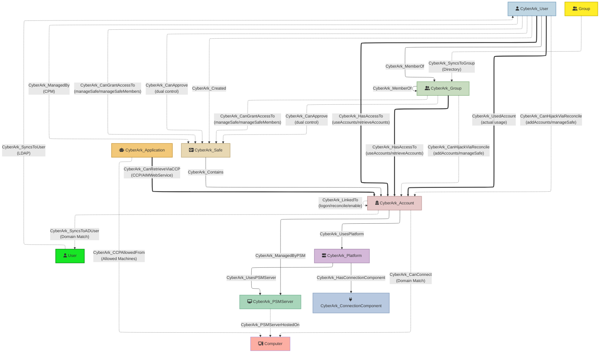

## CyberArkHound

Export CyberArk PVWA data (users, groups, safes, accounts, platforms and permissions) into a BloodHound-compatible OpenGraph JSON file for security analysis and attack path visualization.

### Quick Start

**Windows:**
```pwsh
# Download or build the binary
go build -o cyberarkhound.exe ./cmd/cyberarkhound

# Run the tool
.\cyberarkhound.exe `
    --pvwa https://pvwa.example.com `
    --username svc-bloodhound `
    --password $Env:CYBERARK_PASSWORD `
    --output cyberark_export.json `
    --target-domains corp.example.com
```

**Linux/macOS:**
```bash
# Build the binary
go build -o cyberarkhound ./cmd/cyberarkhound

# Run the tool
./cyberarkhound \
    --pvwa https://pvwa.example.com \
    --username svc-bloodhound \
    --password "$CYBERARK_PASSWORD" \
    --output cyberark_export.json \
    --target-domains corp.example.com
```

The resulting `cyberark_export.json` file can be directly imported into BloodHound.

### Features
- **High Performance**: Go implementation with concurrent processing and efficient memory usage
- **Robust API client** with exponential backoff retry logic and optional SSL customization
- **Comprehensive data extraction**: Users, groups, safes, accounts with full property sets
- **Permission-based access modeling**: Direct account access vs privilege escalation paths
- **LDAP/Directory sync tracking**: Identify synced vs local users and groups
- **External AD entity inference**: Automatic detection of relationships to Active Directory
- **Account activity tracking**: Optional CyberArk_UsedAccount edges showing actual usage patterns
- **Linked account chain analysis**: Optional CyberArk_LinkedTo edges mapping logon/reconcile/enable account dependencies for credential chain traversal
- **Safe creator and CPM tracking**: CyberArk_Created and CyberArk_ManagedBy edges showing who created and manages each safe
- **Platform-based grouping**: Optional CyberArk_Platform nodes and CyberArk_UsesPlatform edges for shared attack surface analysis
- **PSM infrastructure mapping**: Optional CyberArk_PSMServer and CyberArk_ConnectionComponent nodes with edges showing which PSM servers and connection protocols (RDP, SSH, etc.) each platform and account uses; CyberArk_PSMServerHostedOn external edges link PSM servers to their AD Computer objects
- **CCP / AIMWebService attack-surface mapping**: Optional CyberArk_Application nodes (AppIDs) with CyberArk_CanRetrieveViaCCP edges showing which credentials each Central Credential Provider application can pull via the AIMWebService REST API. Applications are flagged when they have **no authentication restrictions** (`isUnrestricted`) or are the **default AIMWebService AppID** (`isDefaultCCPApp`), surfacing the "shortest path to privileged accounts" tradecraft documented by [Marat Nigmatullin (FalconForce)](#tradecraft-reference) at SO-CON 2026
- **Reconcile-account hijack mapping**: CyberArk_CanHijackViaReconcile edges (principal → privileged reconcile account) show who can coerce the CPM into resetting a target's password via a platform's reconcile account — the second attack vector from [Nigmatullin's SO-CON 2026 talk](#tradecraft-reference)
- **Dual control awareness**: Per-account `requiresApproval` derived from platform Master Policy settings (with approver-presence fallback); CyberArk_CanApprove edges identify who can authorize dual-controlled access
- **Master Policy exception detection**: Flags on platform nodes identify deviations from Master Policy defaults for audit and compliance
- **Resilient platform data**: Automatic fallback to `/API/Platforms/Targets` when `/API/Platforms/` is unavailable, preserving all security-relevant properties
- **Enriched metadata**: Personal details, vault authorizations, safe permissions, account management status
- **Safe permission tracking**: Per-user/group safe access with permission details
- **External edges preserved**: AD sync relationships stored separately for cross-domain analysis
- **Security findings summary**: End-of-run report of the highest-value misconfigurations (unrestricted CCP AppIDs, default AIMWebService, wildcard `AllowedSafes`, safes without CPM) computed from collected data — no extra API calls
- **Deterministic output**: Nodes and edges are emitted in a stable, sorted order so exports diff cleanly across runs
- **Debug logging**: Comprehensive diagnostics for troubleshooting data flow

### CyberArk User Permissions Required
To successfully ingest data from CyberArk PVWA, the API user needs specific vault authorizations, the user running this tool must have the **Audit Users** vault authorization which provides read access to all users and groups in the vault.
The users requires 'list' and 'View Safe members' permissions on all safes within CyberArk, either directly or through group membership which will allow the user to view all accounts and safes within CyberArk.

Alternativly the user can be a member of local CyberArk vault group 'Auditors', this will grant the user read only access to all safes, accounts and groups. However the permission to view the session (PSM) recordings which is not advisable

#### Recommended Setup
Create a dedicated service account for BloodHound data collection:

1. **Create Vault User**: `bloodhound-collector` (or similar)
2. **Grant Vault Authorization**: `Audit Users`
3. **Authentication Method**: CyberArk authentication (LDAP/RADIUS also supported)
4. **User Type**: EPVUser (non-LDAP) or Directory User
5. **Safe Permissions**: The user needs to be a member of all the safes in the environment or a member of a group that is a member to all the safes in CyberArk. Permissions required are 'list' and 'View Safe Members'
6. **Store this account within CyberArk**: to ensure it is rotated as per CyberArk policies
7. **Retrieve the credential using CCP/CP**: if CCP/CP is used within the environment, use this to retreive the credetial as and when required

#### What the Tool Can view
With `Audit Users` authorization, the tool can:
- ✅ List all vault users and groups
- ✅ View user group memberships

With 'list' and 'View Safe Members' on each safe, the tool can:
- ✅ List all accounts in safes (no credentials)
- ✅ List all safes in the vault
- ✅ List all safe members and their permissions

#### What the Tool can not do:
- ❌ **Cannot** retrieve or view account passwords
- ❌ **Cannot** modify any vault objects
- ❌ **Cannot** modify platform application settings

#### API Endpoints Used
- `POST /API/Auth/CyberArk/Logon` - Authentication
- `GET /API/safes` - List all safes
- `GET /API/Safes/{safeUrlId}/Members` - List safe members and permissions
- `GET /API/Accounts` - List accounts (filtered by safe)
- `GET /API/Accounts/{accountId}` - Get account details
- `GET /API/Accounts/{accountId}/Activities` - Get account activity logs (optional, requires `--include-activity`)
- `GET /API/Accounts/{accountId}/LinkedAccounts` - Get linked accounts: logon, reconcile, enable (optional, requires `--include-linked-accounts`)
- `GET /API/Platforms/` - List all platforms with full configuration (optional, requires `--include-platforms`)
- `GET /API/Platforms/Targets` - List target platforms with exception flags (optional, requires `--include-platforms`; also used as fallback when `/API/Platforms/` fails)
- `GET /API/Platforms/Targets/{id}/PrivilegedSessionManagement` - Get per-platform PSM connectors (optional, requires `--include-platforms`)
- `GET /API/PSM/Servers/` - List all PSM servers (optional, requires `--include-psm`)
- `GET /API/PSM/Connectors/` - List all connection components (optional, requires `--include-psm`)
- `GET /WebServices/PIMServices.svc/Applications/` - List CCP/AIMWebService applications (AppIDs) (optional, requires `--include-applications`)
- `GET /WebServices/PIMServices.svc/Applications/{AppID}/Authentications/` - Get per-application authentication restrictions: allowed machines, OS user, path, hash, certificate (optional, requires `--include-applications`)
- `GET /API/Users` - List all users
- `GET /API/UserGroups` - List all groups
- `GET /API/UserGroups/{groupId}` - Get group details with members
- `POST /API/Auth/Logoff` - Session cleanup

#### Security Considerations
- The `Audit Users` authorization is read-only and cannot modify vault data
- API calls do not retrieve password values
- Use a dedicated service account with long/complex password
- Rotate credentials periodically
- Monitor API usage via PVWA audit logs
- Consider IP restrictions for the service account
- Adding the user to the 'Auditors' groups is easy to provide required perms but grants too much access

### Installation

**Requirements:**
- Go 1.21 or later
- Git (for cloning the repository)

**Build from source:**
```pwsh
# Clone the repository
git clone https://github.com/jazofra/CyberArkHound
cd CyberArkHound

# Build the binary
go build -o cyberarkhound.exe ./cmd/cyberarkhound

# Or install directly to $GOPATH/bin
go install ./cmd/cyberarkhound
```

**Pre-built binaries:**
Download pre-compiled binaries from the [Releases](https://github.com/jazofra/CyberArkHound/releases) page.

### Usage

**Basic usage:**
```pwsh
.\cyberarkhound.exe `
    --pvwa https://pvwa.example.com `
    --username api_user `
    --password $Env:CYBERARK_PASSWORD `
    --output export.json `
    --target-domains corp.example.com,lab.example.com
```

**With activity tracking:**
```pwsh
.\cyberarkhound.exe `
    --pvwa https://pvwa.corp.com `
    --username svc-bloodhound `
    --password $Env:CYBERARK_PASSWORD `
    --output cyberark_export.json `
    --target-domains corp.example.com,lab.example.com `
    --include-activity `
    --activity-days 30 `
    --workers 100
```

**With debugging:**
```pwsh
.\cyberarkhound.exe `
    --pvwa https://pvwa.corp.com `
    --username svc-bloodhound `
    --password $Env:CYBERARK_PASSWORD `
    --output cyberark_export.json `
    --target-domains corp.example.com `
    --debug `
    --log-level DEBUG
```

**Performance tips for large environments:**
- Increase `--workers` to 100-200 for faster parallel processing
- Use `--log-level WARNING` to reduce logging overhead
- The tool uses efficient memory management with native goroutines for true parallelism
- Re-authentication is single-flighted: when multiple workers receive HTTP 401 simultaneously, only one re-authenticates while the others wait and reuse the refreshed token — avoiding thundering-herd token churn

### Command-Line Arguments

**Required:**
- `--pvwa` Base PVWA URL (e.g., https://pvwa.example.com)
- `--username` API username
- `--password` API password (consider using environment variable)
- `--output` Destination JSON file for BloodHound import
- `--target-domains` One or more AD domain names (comma-separated) used to link accounts to AD users

**Optional:**
- `--workers` Concurrency for parallel operations (default: 50, recommended: 100-200 for large environments)
- `--insecure` Disable SSL verification (NOT recommended for production)
- `--ca-bundle` Path to custom CA bundle for SSL verification
- `--auth-timeout` Authentication timeout in seconds (default: 360)
- `--req-timeout` Request timeout in seconds (default: 360)
- `--quiet` Suppress info/debug logs
- `--debug` Enable debug logging with detailed diagnostics
- `--log-level` Set logging level: DEBUG, INFO (default), WARNING, ERROR
- `--user-extended-details-timeout` Timeout for optional `Users?ExtendedDetails=true` before falling back to the basic user list (default: 60s)
- `--safe-page-limit` Safes page size for pagination (default: 100; lower can help slow or error-prone PVWA)
- `--max-reauth-attempts` Max re-authentication attempts on HTTP 401 before giving up (default: 5)

When the bulk `GET /API/Users?ExtendedDetails=true` endpoint times out, CyberArkHound falls back to `GET /API/Users` and enriches each user individually through the user details endpoint. This preserves extended user fields while avoiding a single large PVWA response as a hard dependency. The existing `--workers` value controls this per-user enrichment concurrency.

**Activity Tracking:**
- `--include-activity` Include account activity data (creates CyberArk_UsedAccount edges)
- `--activity-days` Number of days to look back for activity (default: 3)
- `--activity-limit` Max activities per account to fetch from API (default: 100)

**Linked Accounts & Platforms:**
- `--include-linked-accounts` Include linked account data (creates CyberArk_LinkedTo edges for logon/reconcile/enable account chains)
- `--include-platforms` Include platform data (creates CyberArk_Platform nodes and CyberArk_UsesPlatform edges)
- `--include-psm` Include PSM server and connection component data (creates CyberArk_PSMServer and CyberArk_ConnectionComponent nodes with linking edges)
- `--include-applications` Include CCP/AIMWebService application (AppID) data (creates CyberArk_Application nodes and CyberArk_CanRetrieveViaCCP edges). Requires the collector to be able to list Applications (typically the `Manage Users` vault authorization or membership in the relevant application safes)

**Testing/Development:**
- `--limit-users` Limit number of users to process (0 = no limit)
- `--limit-groups` Limit number of groups to process (0 = no limit)
- `--limit-safes` Limit number of safes to process (0 = no limit)
- `--test-safe` Process only safes matching search term

### Edge Types and Permission Interpretation

The tool creates different edge types based on the permissions a user/group has on a safe:

#### CyberArk_HasAccessTo (User/Group → Account)
**Direct account access** - User/group can immediately use or retrieve account credentials:
- `useAccounts`: Use accounts via PSM connections without viewing passwords
- `retrieveAccounts`: Retrieve and view account passwords

**Pattern**: When a user has these permissions on a safe, edges are created from the user directly to **each account** in that safe. This clearly shows which accounts the user can access.

**BloodHound Query Examples:**
```cypher
// Find all accounts a user can access
MATCH (u:CyberArk_User {name: "jdoe"})-[:CyberArk_HasAccessTo]->(a:CyberArk_Account)
RETURN a.name

// Find all users who can access a specific account
MATCH (u:CyberArk_User)-[:CyberArk_HasAccessTo]->(a:CyberArk_Account {name: "prod-db-admin"})
RETURN u.name

// Find LDAP users with direct account access
MATCH (u:CyberArk_User {isLDAPSynced: true})-[:CyberArk_HasAccessTo]->(a:CyberArk_Account)
RETURN u.name, a.name
```

#### CyberArk_CanGrantAccessTo (User/Group → Safe)
**Privilege escalation** - User/group can modify safe to grant themselves account access:
- `manageSafe`: Update safe properties, recover safe, delete safe
- `manageSafeMembers`: Add/remove safe members and modify their permissions

**Attack path**: A user with `manageSafeMembers` can add themselves with `retrieveAccounts`, then access all accounts in the safe. This edge points to the **safe** itself since the user must first escalate privileges before accessing accounts.

**BloodHound Query Examples:**
```cypher
// Find privilege escalation paths to accounts
MATCH (u:CyberArk_User)-[:CyberArk_CanGrantAccessTo]->(s:CyberArk_Safe)-[:CyberArk_Contains]->(a:CyberArk_Account)
RETURN u.name, s.name, a.name

// Find users who can grant themselves access to production safes
MATCH (u:CyberArk_User)-[:CyberArk_CanGrantAccessTo]->(s:CyberArk_Safe)
WHERE s.safeName CONTAINS "prod"
RETURN u.name, s.safeName
```

#### Edge Types Summary

| Edge | Direction | Source | Security Value |
|------|-----------|--------|----------------|
| `CyberArk_HasAccessTo` | User/Group → Account | Safe member `useAccounts`/`retrieveAccounts` | Direct credential access; `requiresApproval` shows if dual control blocks retrieval |
| `CyberArk_CanRetrieveViaCCP` | Application → Account | Application safe member `useAccounts`/`retrieveAccounts` + `GET /WebServices/PIMServices.svc/Applications` | CCP/AIMWebService credential retrieval via a single GET request; `appIsUnrestricted` and `isDefaultCCPApp` flag the highest-risk AppIDs ([Nigmatullin, SO-CON 2026](#tradecraft-reference)) |
| `CyberArk_CCPAllowedFrom` | Application → AD Computer | Application `machineAddress` authentications (Allowed Machines) | External edge — which hosts may present the AppID to CCP; `machineIsOnlyRestriction` flags when landing on the host is sufficient to wield the AppID |
| `CyberArk_CanGrantAccessTo` | User/Group → Safe | Safe member `manageSafe`/`manageSafeMembers` | Privilege escalation — can grant themselves account access |
| `CyberArk_CanHijackViaReconcile` | User/Group → Account | Safe member `addAccounts`/`manageSafe` + reconcile linked account (`GET /API/Accounts/{id}/LinkedAccounts`) | Privilege escalation — can coerce the CPM to reset a target's password using a privileged reconcile account ([Nigmatullin, SO-CON 2026](#tradecraft-reference)) |
| `CyberArk_CanApprove` | User/Group → Safe | Safe member `requestsAuthorizationLevel1`/`Level2` | Can approve dual-controlled access requests (L1/L2) |
| `CyberArk_UsedAccount` | User → Account | `GET /API/Accounts/{id}/Activities` | Actual usage audit trail — who really accessed what |
| `CyberArk_LinkedTo` | Account → Account | `GET /API/Accounts/{id}/LinkedAccounts` | Logon/reconcile/enable credential chains — compromising one propagates to all dependents |
| `CyberArk_Created` | User → Safe | Existing `Safe.Creator` field | Shows who created each safe (implicit ownership/access) |
| `CyberArk_ManagedBy` | CPM User → Safe | Existing `Safe.ManagingCPM` field | CPM accounts have privileged password management access |
| `CyberArk_UsesPlatform` | Account → Platform | `GET /API/Platforms/Targets` | Shared platform config = shared attack surface |
| `CyberArk_UsesPSMServer` | Platform → PSM Server | Platform `PSMServerID` field | Which PSM server handles sessions for each platform |
| `CyberArk_ManagedByPSM` | Account → PSM Server | Derived via account's platform | Direct link for querying which PSM server manages an account's sessions |
| `CyberArk_HasConnectionComponent` | Platform → Connection Component | `GET /API/Platforms/Targets/{id}/PrivilegedSessionManagement` | Which connection protocols (RDP, SSH, etc.) are enabled per platform |
| `CyberArk_PSMServerHostedOn` | PSM Server → AD Computer | PSM Server `Address` field (uppercased) | External edge — maps PSM server to its AD Computer object |
| `CyberArk_MemberOf` | User/Group → Group | Group membership data | Group-based permission inheritance |
| `CyberArk_Contains` | Safe → Account | Account's `safeName` field | Safe-account containment relationship |
| `CyberArk_InstanceContains` | Instance → Safe/Platform/PSM Server/Connection Component | Derived (one root per PVWA tag) | Environment root containment — scopes bounded configuration objects to their PVWA instance. Users and groups are excluded to avoid a multi-million-edge fan-out in LDAP-synced vaults |
| `CyberArk_SyncsToUser` | AD User → CyberArk_User | LDAP DN with `DC=` | External edge — AD-to-CyberArk identity mapping |
| `CyberArk_SyncsToGroup` | AD Group → CyberArk_Group | LDAP DN with `DC=` | External edge — AD-to-CyberArk group mapping |
| `CyberArk_SyncsToADUser` | CyberArk_Account → AD User | Account address matches target domain | External edge — credential-to-AD-user mapping |
| `CyberArk_CanConnect` | CyberArk_Account → AD Computer | Account address matches address subdomain of the target domain (Local accounts) | External edge — credential-to-AD-computer mapping |

**Note**: Permissions like `listAccounts`, `viewAuditLog`, `addAccounts`, `updateAccountContent` do **not** create access edges as they don't allow password retrieval or account usage.

#### CyberArk_UsedAccount (User → Account) - Optional
**Actual account usage** - Tracks when users have actually retrieved or used accounts (not just permission):
- Created when `--include-activity` flag is used
- Based on CyberArk activity/audit logs via `/API/Accounts/{accountId}/Activities`
- Shows real-world account access patterns from the last 3 days (default)
- Helps identify dormant vs actively used accounts
- One edge per user-account pair (aggregates multiple activities)

**Pattern**: Edges are created from users to accounts they've actually accessed within the specified time window (`--activity-days`). Multiple activities by the same user are aggregated into a single edge showing the most recent action.

**Edge Properties**:
- `lastUsedTime`: ISO 8601 timestamp of most recent access (e.g., "2025-11-25T14:32:01+00:00")
- `lastActivity`: Most recent action performed (e.g., "CPM Verify Password", "RetrievePassword", "ShowPassword")
- `usageCount`: Total number of times this user accessed this account in the time window
- `inferred`: false (based on actual audit data)

**Technical Details**:
- Activities are filtered by Unix timestamp (Date field >= current_time - days * 86400)
- Only activities within the lookback window are processed
- If a user performed multiple actions, only the most recent is stored in `lastActivity`
- The `usageCount` reflects all qualifying activities, not just the latest one
- Parallel processing used for activity fetching (50 workers by default)

**BloodHound Query Examples:**
```cypher
// Find who actually used high-value accounts
MATCH (u:CyberArk_User)-[r:CyberArk_UsedAccount]->(a:CyberArk_Account)
WHERE a.safeName CONTAINS "prod"
RETURN u.name, a.name, r.lastUsedTime, r.lastActivity, r.usageCount
ORDER BY r.lastUsedTime DESC

// Find accounts with access permissions but no actual usage (dormant/unused)
MATCH (u:CyberArk_User)-[:CyberArk_HasAccessTo]->(a:CyberArk_Account)
WHERE NOT (u)-[:CyberArk_UsedAccount]->(a)
RETURN u.name, a.name, a.safeName

// Find users who accessed accounts they shouldn't have permission for (privilege escalation)
MATCH (u:CyberArk_User)-[:CyberArk_UsedAccount]->(a:CyberArk_Account)
WHERE NOT (u)-[:CyberArk_HasAccessTo]->(a)
RETURN u.name, a.name

// Find most active users
MATCH (u:CyberArk_User)-[r:CyberArk_UsedAccount]->(a:CyberArk_Account)
RETURN u.name, COUNT(a) as accountsUsed, SUM(r.usageCount) as totalAccesses
ORDER BY totalAccesses DESC
LIMIT 10
```

**Performance Note**: Activity tracking adds significant API calls (one per account). For large environments (1000+ accounts), expect:
- Additional 5-15 minutes processing time due to parallel API requests
- Default lookback is 3 days to balance recency with performance
- Use `--activity-days 7` or `--activity-days 30` for longer historical analysis
- Use `--activity-limit` to cap activities fetched per account (default: 100)
- Activity fetching runs in parallel (50 threads) for optimal performance
- Can be run separately from initial data collection for incremental updates

#### Dual Control (Access Confirmation) Awareness
CyberArk's dual control feature requires users to get approval from authorized Safe members before retrieving passwords. CyberArkHound determines dual control status using a combination of platform policy data and safe member permissions.

**How CyberArk Dual Control works:**

Dual control is governed by the **Master Policy** rule "Require dual control password access approval", which can be set globally or overridden per platform. The effective policy for each platform is exposed via the `GET /API/Platforms/` endpoint in the `privilegedAccessWorkflows.requireDualControlPasswordAccessApproval` field. Safe members with `requestsAuthorizationLevel1` or `requestsAuthorizationLevel2` permissions act as the **approvers** who confirm or reject access requests.

**How CyberArkHound determines `requiresApproval`:**

The `requiresApproval` property on `CyberArk_HasAccessTo` edges is computed **per-account** using a layered approach:

| Layer | Source | Check |
|-------|--------|-------|
| 1. Platform policy (primary) | `GET /API/Platforms/` → `requireDualControlPasswordAccessApproval` | Is dual control enabled for the account's platform in the effective Master Policy? |
| 2. Approver presence (enforcement) | Safe member permissions → `requestsAuthorizationLevel1` / `Level2` | Does the safe have at least one member who can approve requests? Without approvers, dual control is unenforceable even if the policy enables it. |
| 3. Member bypass | Safe member permissions → `accessWithoutConfirmation` | Can this specific member bypass dual control? If `true`, `requiresApproval` is always `false`. |

An account's `requiresApproval` is `true` only when **all three conditions** are met:
1. The account's platform has `requireDualControlPasswordAccessApproval: true`
2. The safe has at least one member with L1/L2 approval permissions
3. The accessing member does **not** have `accessWithoutConfirmation: true`

**Fallback when platform data is unavailable:**
When `--include-platforms` is not used, the platform policy cannot be checked. In this case, CyberArkHound falls back to an **approver-presence heuristic**: if the safe has members with L1/L2 approval permissions, dual control is assumed to be active. This can produce false positives (e.g., approver permissions exist from a template but the Master Policy has dual control disabled). Use `--include-platforms` for accurate dual control detection.

**CyberArk safe member permissions used:**

| Permission | Type | Role |
|------------|------|------|
| `accessWithoutConfirmation` | bool | Member can bypass dual control and retrieve passwords without approval |
| `requestsAuthorizationLevel1` | bool | Member can approve Level 1 access requests from other users |
| `requestsAuthorizationLevel2` | bool | Member can approve Level 2 access requests from other users |

**Platform policy field used (requires `--include-platforms`):**

| Field | Source | Meaning |
|-------|--------|---------|
| `requireDualControlPasswordAccessApproval` | `GET /API/Platforms/` → `privilegedAccessWorkflows` | The effective Master Policy setting for this platform, including any platform-level exceptions |

**Edge Properties on CyberArk_HasAccessTo:**
- `requiresApproval`: `true` if the member needs approval from a dual control authorizer before retrieving passwords
- `requiresSessionMonitoring`: `true` if the account's platform requires PSM session monitoring and isolation
- `recordsSessionActivity`: `true` if the account's platform records and saves session activity

**CyberArk_CanApprove Edge Properties:**
- `approvalLevel`: Authorization level (1 or 2) — maps to `requestsAuthorizationLevel1` / `requestsAuthorizationLevel2` permissions

**BloodHound Query Examples:**
```cypher
// Users who can retrieve passwords WITHOUT any approval (highest risk)
MATCH (u:CyberArk_User)-[r:CyberArk_HasAccessTo {requiresApproval: false}]->(a:CyberArk_Account)
RETURN u.name, a.name, a.safeName

// Users who REQUIRE approval — attack needs both accessor + approver
MATCH (u:CyberArk_User)-[r:CyberArk_HasAccessTo {requiresApproval: true}]->(a:CyberArk_Account)
RETURN u.name, a.name, a.safeName

// Find approvers who can unlock access for dual-controlled safes
MATCH (approver)-[r:CyberArk_CanApprove]->(s:CyberArk_Safe)-[:CyberArk_Contains]->(a:CyberArk_Account)
RETURN approver.name, r.approvalLevel, s.safeName, COLLECT(a.name)

// Full dual control attack path: need BOTH a user with access AND an approver
MATCH (u:CyberArk_User)-[access:CyberArk_HasAccessTo {requiresApproval: true}]->(a:CyberArk_Account)
MATCH (a)<-[:CyberArk_Contains]-(s:CyberArk_Safe)<-[approve:CyberArk_CanApprove]-(approver)
RETURN u.name AS accessor, a.name AS account, approver.name AS approver, approve.approvalLevel

// Users who are BOTH accessor and approver on the same safe (dual control bypass risk)
MATCH (u)-[access:CyberArk_HasAccessTo {requiresApproval: true}]->(a:CyberArk_Account)
MATCH (a)<-[:CyberArk_Contains]-(s:CyberArk_Safe)<-[:CyberArk_CanApprove]-(u)
RETURN u.name, s.safeName, COLLECT(a.name) AS selfApprovableAccounts

// Find platforms where dual control is enabled
MATCH (p:CyberArk_Platform {requireDualControlPasswordAccessApproval: true})
RETURN p.name, p.systemType

// Accounts on dual-control platforms but in safes without approvers (policy misconfiguration)
MATCH (a:CyberArk_Account)-[:CyberArk_UsesPlatform]->(p:CyberArk_Platform {requireDualControlPasswordAccessApproval: true})
MATCH (s:CyberArk_Safe)-[:CyberArk_Contains]->(a)
WHERE NOT ()-[:CyberArk_CanApprove]->(s)
RETURN a.name, s.safeName, p.name AS platform

// High-risk: accounts accessible WITHOUT session monitoring
MATCH (u:CyberArk_User)-[r:CyberArk_HasAccessTo {requiresSessionMonitoring: false}]->(a:CyberArk_Account)
RETURN u.name, a.name, a.safeName

// Platforms that support RDP connections
MATCH (p:CyberArk_Platform)
WHERE 'PSM-RDP' IN p.connectionComponents
RETURN p.name, p.connectionComponents

// Platforms where dual control is DISABLED as an exception to Master Policy (high priority audit finding)
MATCH (p:CyberArk_Platform)
WHERE p.requireDualControlPasswordAccessApproval = false AND p.dualControlIsException = true
RETURN p.name, p.systemType

// Platforms where session monitoring is disabled as a Master Policy exception
MATCH (p:CyberArk_Platform)
WHERE p.requirePrivilegedSessionMonitoringAndIsolation = false AND p.sessionMonitoringIsException = true
RETURN p.name, p.systemType

// Find all PSM servers and their connected platforms
MATCH (p:CyberArk_Platform)-[:CyberArk_UsesPSMServer]->(psm:CyberArk_PSMServer)
RETURN psm.name, psm.address, COLLECT(p.name) AS platforms

// Find accounts managed by a specific PSM server
MATCH (a:CyberArk_Account)-[:CyberArk_ManagedByPSM]->(psm:CyberArk_PSMServer {name: "PSM Server Main"})
RETURN a.name, a.userName, a.safeName

// Find platforms with RDP connection components enabled
MATCH (p:CyberArk_Platform)-[:CyberArk_HasConnectionComponent]->(cc:CyberArk_ConnectionComponent {connectorId: "PSM-RDP"})
RETURN p.name, p.systemType

// List all connection components and which platforms use them
MATCH (p:CyberArk_Platform)-[:CyberArk_HasConnectionComponent]->(cc:CyberArk_ConnectionComponent)
RETURN cc.connectorId, cc.displayName, COLLECT(p.name) AS platforms

// Find AD Computers hosting PSM servers
MATCH (psm:CyberArk_PSMServer)-[:CyberArk_PSMServerHostedOn]->(c:Computer)
RETURN psm.name, c.name

// Find accounts on platforms created from fallback data (investigate /API/Platforms/ failure)
MATCH (a:CyberArk_Account)-[:CyberArk_UsesPlatform]->(p:CyberArk_Platform {dataSource: "targets-fallback"})
RETURN p.name, COUNT(a) AS accountCount
```

#### CyberArk_LinkedTo (Account → Account) - Optional
**Linked account dependencies** - Maps credential chains where one account depends on another for logon, reconciliation, or enablement:
- Created when `--include-linked-accounts` flag is used
- Based on CyberArk linked accounts via `/API/Accounts/{accountId}/LinkedAccounts`
- Link types: `logon` (ExtraPassID=1), `enable` (ExtraPassID=2), `reconcile` (ExtraPassID=3)
- Critical for attack path analysis: compromising a logon account gives access to all accounts that depend on it

**Edge Properties**:
- `linkType`: Type of link — `logon`, `enable`, `reconcile`, or `unknown`
- `linkName`: Name of the linked account relationship
- `safeName`: Safe containing the linked account

**BloodHound Query Examples:**
```cypher
// Find all accounts that depend on a specific logon account
MATCH (logon:CyberArk_Account {name: "svc-logon"})<-[r:CyberArk_LinkedTo {linkType: "logon"}]-(a:CyberArk_Account)
RETURN a.name, a.safeName

// Find credential chains: accounts linked through logon accounts
MATCH path = (a:CyberArk_Account)-[:CyberArk_LinkedTo*1..3]->(target:CyberArk_Account)
RETURN path

// Find all reconcile account dependencies
MATCH (a:CyberArk_Account)-[r:CyberArk_LinkedTo {linkType: "reconcile"}]->(reconciler:CyberArk_Account)
RETURN a.name, reconciler.name, reconciler.safeName

// Attack path: user with access to a logon account can reach all dependent accounts
MATCH (u:CyberArk_User)-[:CyberArk_HasAccessTo]->(logon:CyberArk_Account)<-[:CyberArk_LinkedTo {linkType: "logon"}]-(dependent:CyberArk_Account)
RETURN u.name, logon.name, COLLECT(dependent.name) as dependentAccounts
```

**Performance Note**: Linked account fetching adds one API call per account. Runs in parallel (50 workers by default).

#### CyberArk_Created (User → Safe)
**Safe creator relationship** - Shows which user created each safe:
- Always emitted (no extra API calls — uses existing `Safe.Creator` field)
- Useful for understanding implicit access and ownership

**Edge Properties**:
- `creatorId`: The vault user ID of the creator

**BloodHound Query Examples:**
```cypher
// Find all safes created by a user
MATCH (u:CyberArk_User)-[:CyberArk_Created]->(s:CyberArk_Safe)
RETURN u.name, s.safeName

// Find who created production safes
MATCH (u:CyberArk_User)-[:CyberArk_Created]->(s:CyberArk_Safe)
WHERE s.safeName CONTAINS "prod"
RETURN u.name, s.safeName

// Find users who created safes AND can grant access to them
MATCH (u:CyberArk_User)-[:CyberArk_Created]->(s:CyberArk_Safe)
WHERE (u)-[:CyberArk_CanGrantAccessTo]->(s)
RETURN u.name, s.safeName
```

#### CyberArk_ManagedBy (CPM User → Safe)
**CPM management relationship** - Shows which CPM component manages password rotation for each safe:
- Always emitted (no extra API calls — uses existing `Safe.ManagingCPM` field)
- CPM accounts have privileged access to manage and rotate passwords

**BloodHound Query Examples:**
```cypher
// Find all safes managed by a specific CPM
MATCH (cpm:CyberArk_User)-[:CyberArk_ManagedBy]->(s:CyberArk_Safe)
WHERE cpm.name CONTAINS "CPM"
RETURN cpm.name, COLLECT(s.safeName) as managedSafes

// Find safes without CPM management (unmanaged passwords)
MATCH (s:CyberArk_Safe)
WHERE NOT ()-[:CyberArk_ManagedBy]->(s)
RETURN s.safeName

// Find all accounts reachable through a CPM's managed safes
MATCH (cpm:CyberArk_User)-[:CyberArk_ManagedBy]->(s:CyberArk_Safe)-[:CyberArk_Contains]->(a:CyberArk_Account)
RETURN cpm.name, COUNT(a) as accountCount
```

#### CyberArk_UsesPlatform (Account → Platform) - Optional
**Platform association** - Shows which platform configuration each account uses:
- Created when `--include-platforms` flag is used
- Creates `CyberArk_Platform` nodes from `/API/Platforms/Targets`
- Accounts sharing a platform share configuration, policies, and potential vulnerabilities

**BloodHound Query Examples:**
```cypher
// Find all accounts using a specific platform
MATCH (a:CyberArk_Account)-[:CyberArk_UsesPlatform]->(p:CyberArk_Platform {name: "WinServerLocal"})
RETURN a.name, a.safeName

// Find platforms with the most accounts (highest blast radius)
MATCH (a:CyberArk_Account)-[:CyberArk_UsesPlatform]->(p:CyberArk_Platform)
RETURN p.name, p.systemType, COUNT(a) as accountCount
ORDER BY accountCount DESC

// Find inactive platforms still in use
MATCH (a:CyberArk_Account)-[:CyberArk_UsesPlatform]->(p:CyberArk_Platform {active: false})
RETURN p.name, COUNT(a) as accountsOnInactivePlatform
```

#### CyberArk_CanRetrieveViaCCP (Application → Account) - Optional
**CCP / AIMWebService credential retrieval** - Maps which credentials each CyberArk Application (AppID) can pull through the Central Credential Provider REST API:
- Created when `--include-applications` flag is used
- Built from the application's safe membership (`useAccounts`/`retrieveAccounts`) combined with the Applications list from `GET /WebServices/PIMServices.svc/Applications`
- This is the credential-access path used by automated workflows (CI/CD runners, scripts, services) — and the focus of the tradecraft described in [Marat Nigmatullin's SO-CON 2026 talk](#tradecraft-reference)

**Edge Properties**:
- `canRetrievePassword`: `true` when the application has `retrieveAccounts` (CCP returns the plaintext password); `false` when only `useAccounts`
- `appIsUnrestricted`: `true` when the AppID has **no** authentication restriction (no Allowed Machines and no OS user / path / hash / certificate binding) — knowing the AppID alone is enough to retrieve the credential from anywhere that can reach the CCP endpoint
- `isDefaultCCPApp`: `true` for the out-of-the-box `AIMWebService` AppID, which usually has access to **all** safes
- `allowedMachines`: list of IPs/hosts permitted to use the AppID (empty when unrestricted)
- `safeName`, `permissions`: the safe and the granted permission names

### Central Credential Provider (CCP / AIMWebService) Tradecraft

> **Tradecraft credit:** This mapping implements the attack surface presented by **Marat Nigmatullin** (`@_mnigma_`, FalconForce) in **"4 GET requests = 3 Domain admins: CyberArk magic you didn't know about"** at **SO-CON 2026**. See the [Tradecraft Reference](#tradecraft-reference) section for links.

The **Central Credential Provider (CCP)** is an optional CyberArk PAM module that lets applications and services retrieve credentials from the Vault at runtime through a REST API (the **AIMWebService**), instead of hardcoding secrets in config files or scripts. The endpoint is:

```
https://<CCP_Server>/AIMWebService/api/Accounts?<parameters>
```

A single request returns **at most one** matching account. Requests are authenticated by an **Application (AppID)** rather than an interactive PVWA user, and — critically — **are not subject to dual-control approval**.

#### Why this matters for attack paths
- An AppID is just an identity object that is a **member of one or more safes** with `retrieveAccounts`/`useAccounts`. If you can reach the CCP endpoint and present a valid AppID, you can pull every credential that AppID is permitted to read — often in **one GET request**.
- The application's only protections are **authentication restrictions**: Allowed Machines (IP/host), OS user, executable path, binary hash, or client certificate. **An AppID with none of these is effectively unauthenticated.** CyberArkHound flags these as `isUnrestricted` / `appIsUnrestricted`.
- The **default `AIMWebService` AppID** that ships with CCP most likely has access to **all safes**. CyberArkHound flags it as `isDefaultCCPApp`.
- **CI/CD runners** (GitLab, Azure DevOps, Bitbucket) that hold an AppID are a common foothold for reaching the CCP endpoint.

#### The CCP request parameters
- **AppID** — the application identity making the request.
- **Query** — a flexible filter combining `Safe`, `Object`, `UserName`, `Address`, `Platform`, etc.
- **QueryFormat** — `Exact` (default) or `RegExp`. With `RegExp`, the `Query` value is treated as a regular expression, enabling **vault enumeration one match at a time**.

#### Example CCP requests (for authorized testing)
```bash
# Exact retrieval of a single known account:
curl -s "https://<CCP_Server>/AIMWebService/api/Accounts?AppID=<AppID>&Safe=<safe>&UserName=<user>&Address=<host>"

# RegExp filter on username:
curl -s "https://<CCP_Server>/AIMWebService/api/Accounts?AppID=<AppID>&QueryFormat=regexp&Query=username=adm"

# RegExp filter on username AND address:
curl -s "https://<CCP_Server>/AIMWebService/api/Accounts?AppID=<AppID>&QueryFormat=regexp&Query=username=adm;address=server2"

# Vault enumeration with character classes:
curl -s "https://<CCP_Server>/AIMWebService/api/Accounts?AppID=<AppID>&QueryFormat=regexp&Query=username=som[a-z]username[0-9];Address=hostname[a-z].local"

# The DEFAULT AppID usually reads every safe:
curl -s "https://<CCP_Server>/AIMWebService/api/Accounts?AppID=AIMWebService&QueryFormat=regexp&Query=username=domainadmin;Address=domain1.local"
```
The JSON response includes the plaintext password in the `Content` field plus account metadata.

#### Detection (defender's view)
Per the talk, CCP brute force / over-broad RegExp sweeps are detectable from the **response message content**: replies containing `"Too many password objects"` or `"The Credential Provider has encountered an error"` indicate that a query matched more than one object (RegExp returns at most one match per request) — a strong signal of enumeration. CCP usage can also be collected centrally (`GET /AIMWebService` provider logs and CCP usage reports), and retrievals appear in the Vault audit trail under the application identity.

#### Related platform misconfiguration: `AllowedSafes=.*`
The same talk highlights platforms whose **`AllowedSafes`** is set to `.*` (match any safe). A platform with a wildcard `AllowedSafes` lets its **reconcile / logon** accounts be attached to unexpected safes, broadening the blast radius of a platform-level compromise. CyberArkHound flags these platforms with `allowedSafesIsWildcard: true` so they can be audited and restricted.

#### BloodHound Query Examples
```cypher
// Highest risk: unrestricted AppIDs that can retrieve passwords via CCP
MATCH (app:CyberArk_Application)-[r:CyberArk_CanRetrieveViaCCP {appIsUnrestricted: true, canRetrievePassword: true}]->(a:CyberArk_Account)
RETURN app.name, a.name, a.safeName

// The default AIMWebService AppID and everything it can reach
MATCH (app:CyberArk_Application {isDefaultCCPApp: true})-[:CyberArk_CanRetrieveViaCCP]->(a:CyberArk_Account)
RETURN app.name, COUNT(a) AS reachableAccounts

// List all unrestricted applications (no Allowed Machines / OS user / path / hash / certificate)
MATCH (app:CyberArk_Application {isUnrestricted: true})
RETURN app.name, app.description, app.businessOwnerEmail

// CCP path to AD: an AppID that can pull a credential mapped to a Domain Admin
MATCH (app:CyberArk_Application)-[:CyberArk_CanRetrieveViaCCP]->(a:CyberArk_Account)-[:CyberArk_SyncsToADUser]->(u:User)
RETURN app.name, a.name, u.name

// Platforms with a wildcard AllowedSafes (audit / restrict)
MATCH (p:CyberArk_Platform {allowedSafesIsWildcard: true})
RETURN p.name, p.systemType, p.allowedSafes

// Applications that can retrieve passwords WITHOUT dual control (CCP bypasses approval)
MATCH (app:CyberArk_Application)-[r:CyberArk_CanRetrieveViaCCP {canRetrievePassword: true}]->(a:CyberArk_Account)
RETURN app.name, app.isUnrestricted, a.name, a.safeName
```

### Security Findings

At the end of each run, CyberArkHound logs a **Security Findings** summary derived entirely from the collected data (no extra API calls), so the highest-value misconfigurations surface without writing any Cypher:

| Finding | Severity | Source |
|---------|----------|--------|
| Unrestricted CCP applications (AppIDs) | Critical | `CyberArk_Application.isUnrestricted` |
| Credentials retrievable by unrestricted AppIDs via CCP | Critical | `CyberArk_CanRetrieveViaCCP` (`appIsUnrestricted` + `canRetrievePassword`) |
| Default AIMWebService application present | High | `CyberArk_Application.isDefaultCCPApp` |
| Platforms with wildcard AllowedSafes (`.*`) | High | `CyberArk_Platform.allowedSafesIsWildcard` |
| Reconcile-account hijack paths | High | `CyberArk_CanHijackViaReconcile` edges |
| PSM-routed accounts without session isolation/recording | Medium | `CyberArk_Account.managedByPSM` + `sessionMonitoringEnabled`/`sessionRecordingEnabled` |
| Safes without CPM management | Medium | `CyberArk_Safe.managingCPM` empty |

Only findings with a non-zero count are shown. For full coverage, run with `--include-applications` and `--include-platforms` (both default-on). The CCP-related findings map the tradecraft documented by [Marat Nigmatullin (SO-CON 2026)](#tradecraft-reference).

**Equivalent hunting queries (BloodHound):**
```cypher
// Unrestricted CCP applications
MATCH (app:CyberArk_Application {isUnrestricted: true}) RETURN app.name, app.businessOwnerEmail

// Default AIMWebService application
MATCH (app:CyberArk_Application {isDefaultCCPApp: true}) RETURN app.name

// Platforms with wildcard AllowedSafes
MATCH (p:CyberArk_Platform {allowedSafesIsWildcard: true}) RETURN p.name, p.allowedSafes

// Safes with no managing CPM (unrotated credentials)
MATCH (s:CyberArk_Safe) WHERE s.managingCPM IS NULL OR s.managingCPM = "" RETURN s.safeName

// Hosts from which an unrestricted-by-machine AppID can be wielded
MATCH (app:CyberArk_Application)-[r:CyberArk_CCPAllowedFrom {machineIsOnlyRestriction: true}]->(c:Computer)
RETURN c.name, app.name

// Reconcile-account hijack paths (principal -> privileged reconcile account)
MATCH (p)-[r:CyberArk_CanHijackViaReconcile]->(a:CyberArk_Account)
RETURN p.name, r.viaSafe, a.name

// PSM-routed accounts where session isolation/recording is off (breakout exposure)
MATCH (a:CyberArk_Account {managedByPSM: true})
WHERE a.sessionMonitoringEnabled = false OR a.sessionRecordingEnabled = false
RETURN a.name, a.safeName, a.sessionMonitoringEnabled, a.sessionRecordingEnabled
```

> **Note on `relationship_findings` in `extension/schema.json`:** BloodHound's findings/remediation are an Enterprise-only feature and the exact `relationship_findings` schema shape is not publicly documented, so that array is intentionally left empty rather than populated with an unverified structure that could break ingestion. The findings above are computed and surfaced at collection time instead.

### Validating & Exploiting Findings

> ⚠️ **Authorized testing only.** Everything below is for use during a sanctioned penetration test, red-team engagement, or your own lab. Retrieving credentials, resetting passwords, and authenticating with recovered secrets are all logged in the CyberArk Vault audit trail and may trigger alerting. Have written authorization and a scope before you touch production.

For each finding this section answers three questions: **under which circumstances is it actually exploitable**, **why it works**, and **how to test/validate it**. CyberArkHound only tells you a misconfiguration *exists* — these steps confirm whether it is *reachable and abusable from your position*.

#### Preconditions that gate every CCP finding

The three CCP findings (`CCP_UNRESTRICTED_APP`, `CCP_UNRESTRICTED_RETRIEVAL`, `CCP_DEFAULT_AIMWEBSERVICE`) all depend on the same two things:

1. **Network reachability to the CCP web service.** Credentials are served from `https://<CCP_Server>/AIMWebService/api/Accounts`. The CCP/CP component usually runs on a dedicated server (sometimes co-located with PVWA or behind a load balancer). If you cannot reach that host/port, the finding is not exploitable *from where you are*, regardless of how the AppID is configured. Find it from: the URL applications/scripts use to fetch secrets, CI/CD pipeline config, the `AIMWebService` IIS site, or by probing likely hosts for `/AIMWebService/v1.1/aim.asmx` / `/AIMWebService/api/Accounts`.
2. **The AppID is a safe member with Use/Retrieve on the target safe.** An AppID that authenticates but is a member of nothing returns *"object not found"*, not a password. The `CyberArk_CanRetrieveViaCCP` edges already tell you exactly which safes/accounts each AppID can reach — use them to pick a target.

**The single most useful diagnostic is the CCP error code.** A request that *authenticates* but matches nothing returns something like `APPAP004E Password object matching query ... was not found` — that already proves the AppID is accepted from your position. Authentication/restriction failures look different: `APPAP008E ... is not defined`, `APPAP306E ... not authorized` / address-restriction errors, or `ITATS982E` (machine not allowed). If you get an *authorization/address* error, an unseen restriction (often a network/IP ACL in front of CCP) is blocking you even though the AppID config itself is unrestricted.

#### `CCP_UNRESTRICTED_APP` — Unrestricted CCP applications (Critical)

- **What it is:** an AppID with *no* authentication factor configured — no Allowed Machines, no OS user, no path, no hash, no certificate (`isUnrestricted: true`).
- **Why it works:** CCP authenticates the *application*, not a person. The configured factors (machine address, OS user, executable path, binary hash, client certificate) are the application's credential. With **zero** factors, the AppID *string itself* is the only secret — and CyberArkHound prints it as `app.name`. CCP retrieval needs no interactive PVWA login and is **not subject to dual-control approval**.
- **Exploitable when:** you can reach the CCP service (precondition 1) and the AppID can read at least one safe (precondition 2). Note: a network-layer IP allowlist in front of CCP can still gate you even though the *application object* is unrestricted — the `APPAP`/`ITATS` error tells you which.
- **How to test:**
  ```bash
  # 1. Prove the AppID authenticates from your position (expect a password OR "object not found"):
  curl -sk "https://<CCP_Server>/AIMWebService/api/Accounts?AppID=<AppID>&QueryFormat=exact&Query=Safe=<safe>"

  # 2. Retrieve a specific credential the app can read (pick the target from a CanRetrieveViaCCP edge):
  curl -sk "https://<CCP_Server>/AIMWebService/api/Accounts?AppID=<AppID>&Safe=<safe>&UserName=<user>&Address=<address>"
  # -> JSON; the plaintext password is in the "Content" field.
  ```
- **Confirm impact:** if the recovered account maps to AD (`CyberArk_SyncsToADUser` / `CyberArk_CanConnect` edges), validate the secret out-of-band (e.g. `kinit`, `evil-winrm`, or an SMB auth) to prove it is live.
- **Remediation:** add at least one strong factor — Allowed Machines *plus* path/hash or a client certificate. Machine/IP alone is the weakest (spoofable / shared CI hosts).

#### `CCP_UNRESTRICTED_RETRIEVAL` — Credentials retrievable by unrestricted AppIDs (Critical)

- **What it is:** the "so what" of the finding above — the specific **Application → Account** paths where an unrestricted AppID holds `retrieveAccounts` (not merely `useAccounts`), so CCP will hand back the **plaintext password**. Each count is one reachable credential.
- **Why it's worse than `useAccounts`:** `useAccounts` is intended for PSM-brokered connections; `retrieveAccounts` returns the secret in the `Content` field. The talk's whole point is that this turns "4 GET requests" into domain admin — these edges are exactly those GETs.
- **Exploitable when:** same preconditions, and the edge property `canRetrievePassword: true`.
- **How to test:** for each edge, build an **Exact** query from the account's safe/username/address and confirm the password returns:
  ```bash
  curl -sk "https://<CCP_Server>/AIMWebService/api/Accounts?AppID=<AppID>&QueryFormat=exact&Query=Safe=<safe>;UserName=<user>;Address=<address>"
  ```
  Prefer **Exact** over **RegExp** — RegExp sweeps return one match per request and generate the `"Too many password objects"` / `"The Credential Provider has encountered an error"` responses that defenders alert on (see [Tradecraft Reference](#tradecraft-reference)).
- **Prioritize:** sort these by what the account *is* — accounts with a `CyberArk_SyncsToADUser` edge to a Domain Admin, or `CyberArk_CanConnect` to a Tier-0 host, are the crown jewels.

#### `CCP_DEFAULT_AIMWEBSERVICE` — Default AIMWebService application present (High)

- **What it is:** the out-of-the-box `AIMWebService` AppID exists. It is created with the CCP web service and, in many deployments, ends up a member of a broad set of safes.
- **Why it matters:** the AppID name is **publicly known** — an attacker doesn't have to discover it. If it is also unrestricted (check `isUnrestricted` / the `appIsUnrestricted` edge property) it is the fastest path to "read everything."
- **Exploitable when:** it is a member of target safes *and* not locked down. In a **hardened** install, AIMWebService is restricted to the provider hosts themselves (Allowed Machines = the CP/CCP servers); then it is only usable *from those hosts* — which is exactly what the `CyberArk_CCPAllowedFrom` edges and `machineIsOnlyRestriction` flag tell you. If that flag is true, compromising one of those provider hosts is the route in.
- **How to test:**
  ```bash
  curl -sk "https://<CCP_Server>/AIMWebService/api/Accounts?AppID=AIMWebService&QueryFormat=exact&Query=Safe=<safe>;UserName=<user>"
  ```
  An `APPAP`/`ITATS` address error means it is machine-restricted — pivot to a host listed by `CyberArk_CCPAllowedFrom` and retry from there.
- **Remediation:** scope its safe membership to the minimum, bind it to the provider hosts with strong factors, or remove it if GUI-based application provisioning isn't used.

#### `PLATFORM_WILDCARD_ALLOWEDSAFES` — Platforms with wildcard AllowedSafes (`.*`) (High)

- **What it is:** a platform whose `AllowedSafes` regular expression matches **any** safe (`allowedSafesIsWildcard: true`). This is an *enabling* misconfiguration, not a one-GET exploit — it removes the guardrail that ties a platform (and its automation accounts/policies) to specific safes.
- **Why it matters:** `AllowedSafes` is what stops a powerful platform — especially one with a **reconcile** or **logon** account (often a domain admin) — from being associated with accounts in safes it was never meant to touch. With `.*`, that privileged reconcile credential can be brought to bear far more widely, and you can stage accounts onto the platform from any safe you can write to.
- **Exploitable when (any of):**
  - You hold **Add Accounts** on some safe and can create an account that *uses this platform*, then drive its credential-management automation (e.g. trigger a **reconcile**) so the platform's privileged reconcile account acts on your behalf. Inspect the platform's `linkedAccountTypes` and follow `CyberArk_LinkedTo {linkType:"reconcile"}` / `{linkType:"logon"}` edges to find that account and the safe it lives in.
  - You can retrieve/use the platform's reconcile or logon account directly (then it's a normal credential-access path, but the wildcard means it can be wielded against accounts in unexpected safes).
- **Why it's "High" not "Critical":** it requires a second permission (account creation or access to the linked account) to weaponize — it widens blast radius rather than handing over a password by itself.
- **How to test (intrusive — lab / change-controlled only):**
  1. From the graph, identify the platform's reconcile/logon account and its safe.
  2. In a safe where you have **Add Accounts**, create a throwaway account that uses the wildcard platform and is configured to reconcile.
  3. Trigger reconciliation (`POST /API/Accounts/{id}/Reconcile`) and observe — in the account activity — that the platform's privileged reconcile account performed the action. That confirms the privileged account can be reached via this platform from a safe you control.
- **Remediation:** set `AllowedSafes` to an explicit list/regex scoped to the safes the platform is meant to manage.

#### `RECONCILE_HIJACK_EXPOSURE` — Reconcile-account hijack paths (High)

- **What it is:** `CyberArk_CanHijackViaReconcile` edges — a principal who holds `addAccounts` or `manageSafe` on a safe (`viaSafe`) whose platform defines a privileged **reconcile** account (the target of the edge). This maps the talk's *"Hijacking accounts under a platform with a Reconcile Account"* technique.
- **Why it works:** the reconcile account is the credential the CPM uses to **reset** an account's password when it falls out of sync — it is typically highly privileged (often a domain admin). If you can create or redirect an account on that platform and point it at a victim, the CPM will use the reconcile account to set the **victim's** password to a value stored in the Vault, which you then retrieve. You never need the reconcile account's own password; you borrow its privileges.
- **Exploitable when:** you can add or modify an account on the reconcile-enabled platform (the `permissions` edge property shows which rights you hold), the platform auto-manages or you can trigger reconciliation (`initiateCPMAccountManagementOperations`), and the reconcile account actually has rights over the victim (follow the reconcile account's `CyberArk_SyncsToADUser` / `CyberArk_CanConnect` edges to gauge reach).
- **How to test (intrusive — lab / change-controlled only):**
  ```bash
  # 1. Create an account on the reconcile-enabled platform, addressed at the victim:
  curl -s -X POST "https://<pvwa>/PasswordVault/API/Accounts" -H "Authorization: Bearer $TOKEN" \
    -H 'Content-Type: application/json' \
    -d '{"safeName":"<viaSafe>","platformId":"<reconcilePlatform>","userName":"<victim>","address":"<victim-host>","secretType":"password"}'

  # 2. Trigger reconciliation (CPM uses the privileged reconcile account):
  curl -s -X POST "https://<pvwa>/PasswordVault/API/Accounts/<accountId>/Reconcile" -H "Authorization: Bearer $TOKEN"

  # 3. Retrieve the victim's now-reset password:
  curl -s -X POST "https://<pvwa>/PasswordVault/API/Accounts/<accountId>/Password/Retrieve" \
    -H "Authorization: Bearer $TOKEN" -H 'Content-Type: application/json' -d '{}'
  ```
- **Destructive — heed this:** step 2 **resets the victim's password**, which breaks legitimate use of that account and is highly visible (Windows 4724/4738 reset events; CyberArk audit). Only run against a throwaway victim in a lab or under explicit change control.
- **Remediation:** scope `AllowedSafes` on reconcile-enabled platforms, restrict `addAccounts`/`manageSafe` on safes those platforms manage, and require dual control on reconcile operations.

#### `PSM_BREAKOUT_EXPOSURE` — PSM-routed accounts without session isolation/recording (Medium)

- **What it is:** accounts brokered by a PSM server (`managedByPSM: true`) whose platform has **session isolation disabled** (`sessionMonitoringEnabled: false`) and/or **recording disabled** (`sessionRecordingEnabled: false`). This is the exposure surface for the talk's *"Platform breakouts to PSM servers"* (HTML5 gateway) vector.
- **Why it matters:** PSM is meant to isolate the user from the target and the credential, and to record the session. When isolation is off, the connection may be a *raw* RDP/SSH (the credential is more exposed and the session is easier to break out of to reach the PSM host); when recording is off, a breakout attempt is far quieter. Compromising the PSM host yields access to **every** credential it brokers.
- **Important scope note:** the breakout itself is a **host-level** technique — escaping the published RDP/HTML5 application to get code execution on the PSM server. CyberArkHound maps **where the exposure is** (which accounts route through PSM, via which server, with what monitoring), not the breakout exploit. Use the [PSM infrastructure edges](#edge-types-summary) (`CyberArk_ManagedByPSM`, `CyberArk_UsesPSMServer`, `CyberArk_PSMServerHostedOn`) to identify the target PSM host and its underlying AD computer.
- **Exploitable when:** you have `useAccounts` (PSM-connect) on one of these accounts, the connection component is interactive (RDP/SSH/HTML5 — see `CyberArk_HasConnectionComponent`), and the PSM host is reachable/escapable. Prioritize accounts whose PSM host (`CyberArk_PSMServerHostedOn` → Computer) is itself a high-value or weakly-hardened box.
- **How to test:**
  1. From the graph, pick a `managedByPSM` account with monitoring/recording off that you can `useAccounts` on, and note its PSM server (`CyberArk_ManagedByPSM`) and host (`CyberArk_PSMServerHostedOn`).
  2. Initiate the PSM session (`POST /API/Accounts/{id}/PSMConnect`) and attempt standard published-app escape techniques **within engagement scope** to land on the PSM host.
  3. Success = code execution on the PSM server, from which brokered credentials/recordings are reachable.
- **Remediation:** enable *Require privileged session monitoring and isolation* and *Record and save session activity* on the platform (Master Policy), and harden the PSM hosts against published-app breakout.

#### `SAFE_NO_CPM` — Safes without CPM management (Medium)

- **What it is:** a safe with no managing CPM (`managingCPM` empty), so its credentials have **no automatic rotation**.
- **Why it matters:** it is a **force-multiplier**, not a standalone exploit. Credentials in these safes are likely static and long-lived, which means: (a) anything you recover now will *keep working*; (b) a secret captured from an old export, backup, ticket, or wiki is probably still valid; (c) for Windows accounts, a captured NTLM hash stays usable for pass-the-hash because the password never changes.
- **Exploitable when:** you already have (or later get) *any* exposure of an account in one of these safes — via a CCP finding above, a `CyberArk_HasAccessTo` path, or an out-of-band leak. The lack of CPM is what makes that exposure durable.
- **How to assess:**
  - Cross-reference which accounts in these safes are reachable: do they have `CyberArk_HasAccessTo` or `CyberArk_CanRetrieveViaCCP` edges? Those are the credentials whose value won't rotate out from under you.
  - Check the account's `lastModifiedTime` / `lastReconciledTime` to confirm staleness (a years-old timestamp is a strong signal).
  ```cypher
  MATCH (s:CyberArk_Safe)-[:CyberArk_Contains]->(a:CyberArk_Account)
  WHERE (s.managingCPM IS NULL OR s.managingCPM = "")
  RETURN s.safeName, a.name, a.lastModifiedTime ORDER BY a.lastModifiedTime
  ```
- **Remediation:** assign a CPM to the safe and enable periodic change/verification on the accounts.

### Deterministic Output

Exports are **deterministic**: nodes are written sorted by `id` and edges by a stable `(kind, start, end, properties)` key. Two collections of the same unchanged environment produce byte-identical node/edge ordering, so exports can be diffed across runs to spot real changes.

### Node Properties

#### CyberArk_Instance Properties
- **Identity**: `name`, `pvwaTag` (the 4-character PVWA tag derived from `--pvwa`)
- The environment root node. One `CyberArk_Instance` node is emitted per run and is linked to the bounded set of top-level configuration objects (safes, platforms, PSM servers, connection components) via `CyberArk_InstanceContains`. Users and groups are deliberately excluded — in LDAP/AD-synced vaults they can number in the millions, and a direct fan-out would balloon the export; they attach to the graph through their membership and safe-permission edges instead. Accounts are reached transitively through their safe (`CyberArk_Instance` → `CyberArk_Safe` → `CyberArk_Contains` → `CyberArk_Account`).

#### CyberArk_User Properties
- **Identity**: `userId`, `name`, `userType`, `source`, `isLDAPSynced`
- **Status**: `enabled`, `suspended`, `componentUser`
- **Authentication**: `allowedAuthenticationMethods`, `vaultAuthorization`
- **Directory**: `distinguishedName`, `location`, `authorizedInterfaces`
- **Personal Details**: `firstName`, `lastName`, `email`, `businessEmail`, `businessPhone`, `mobilePhone`, `title`, `organization`, `department`, `profession`, `address` (street, city, state, zip, country)
- **Memberships**: `groupsMembership` (list of group names)
- **Permissions**: `safePermissions` (JSON array with safeName, permissions, hasDirectAccess, canGrantAccess)

#### CyberArk_Group Properties
- **Identity**: `groupId`, `name`, `groupType`, `isDirectorySynced`
- **Directory**: `directory`, `distinguishedName`, `location`
- **Metadata**: `description`, `memberCount`
- **Members**: `members` (list of usernames)
- **Permissions**: `safePermissions` (JSON array with safe access details)

#### CyberArk_Safe Properties
- **Identity**: `safeName`, `safeUrlId`, `safeNumber`
- **Metadata**: `description`, `location`, `creator`
- **CPM**: `managingCPM`, `olacEnabled`
- **Retention**: `numberOfVersionsRetention`, `numberOfDaysRetention`, `autoPurgeEnabled`
- **Timestamps**: `creationTime`, `lastModificationTime`
- **Settings**: `isExpiredMembershipEnable`

#### CyberArk_Account Properties
- **Identity**: `accountId`, `userName`, `platformId`, `address`
- **BloodHound name**: `name` (set to `userName` to avoid collisions with AD user names in OpenGraph matching)
- **Safe**: `safeName`, `safeUrlId`
- **Status**: `status`, `enabled`, `secretType`
- **Management**: `automaticManagementEnabled`, `manualManagementReason`
- **Timestamps**: `createdTime`, `lastModifiedTime`, `lastVerifiedTime`, `lastReconciledTime`, `categoryModificationTime`
- **CPM**: `lastModifiedBy`
- **PSM posture** (set when platform data is available): `managedByPSM` (account is brokered by a PSM server), `sessionMonitoringEnabled`, `sessionRecordingEnabled` — used by the `PSM_BREAKOUT_EXPOSURE` finding
- **Extended**: `platformAccountProperties` (JSON), `secretManagement` (JSON)

#### CyberArk_Platform Properties (requires `--include-platforms`)
- **Identity**: `platformId`, `name`
- **Configuration**: `systemType`, `active`, `platformBaseID`, `platformType`
- **Metadata**: `description`, `allowedSafes`
- **Properties**: `requiredProperties`, `optionalProperties` (field definitions)
- **Linked Accounts**: `linkedAccountTypes` (e.g., LogonAccount, ReconcileAccount)
- **Connection Components**: `connectionComponents` (list of enabled PSM connector IDs, e.g., `["PSM-RDP", "PSM-SSH"]`)
- **Session Management**: `psmServerID`, `requirePrivilegedSessionMonitoringAndIsolation`, `recordAndSaveSessionActivity`
- **Credentials Management**: `allowManualChange`, `performPeriodicChange`, `requirePasswordChangeEveryXDays`, `allowManualVerification`, `performPeriodicVerification`, `requirePasswordVerificationEveryXDays`, `allowManualReconciliation`, `automaticReconcileWhenUnsynched`
- **Privileged Access Workflows**: `requireDualControlPasswordAccessApproval`, `enforceCheckinCheckoutExclusiveAccess`, `enforceOnetimePasswordAccess`, `requireUsersToSpecifyReasonForAccess`
- **Master Policy Exception Flags**: `dualControlIsException`, `exclusiveAccessIsException`, `otpIsException`, `reasonForAccessIsException`, `sessionMonitoringIsException`, `sessionRecordingIsException`, `verificationFrequencyIsException`, `changeFrequencyIsException` — `true` when the platform's setting deviates from the Master Policy default
- **Data Source**: `dataSource` — set to `"targets-fallback"` when the node was created from `/API/Platforms/Targets` instead of `/API/Platforms/` (see fallback behavior below)

**Platform data fallback:** When `GET /API/Platforms/` fails (e.g., HTTP 500 due to corrupted platform definitions), CyberArkHound creates platform nodes from the `GET /API/Platforms/Targets` response instead. These fallback nodes contain most security-relevant properties (workflows, credentials management, PSM server, exception flags) but lack `description`, `platformBaseID`, `platformType`, `requiredProperties`, `optionalProperties`, and `linkedAccountTypes`. Fallback nodes are tagged with `dataSource: "targets-fallback"`.

#### CyberArk_PSMServer Properties (requires `--include-psm`)
- **Identity**: `psmServerId` (e.g., `"PSMServer_7ec0ecb"`)
- **Configuration**: `name` (e.g., `"PSM Server CYB-IS-12345"`), `address` (e.g., `"10.10.10.20"`)

#### CyberArk_ConnectionComponent Properties (requires `--include-psm`)
- **Identity**: `connectorId` (e.g., `"PSM-RDP"`, `"PSM-SSH"`)
- **Display**: `displayName` (e.g., `"RDP"`, `"SSH"`)

#### CyberArk_Application Properties (requires `--include-applications`)
- **Identity**: `appId`, `name` (the AppID), `description`, `location`
- **Status**: `disabled`
- **Business Owner**: `businessOwnerName`, `businessOwnerEmail`, `businessOwnerPhone`
- **Authentication restrictions**: `allowedMachines` (list of permitted IPs/hosts), `authMethods` (distinct AuthType values configured), `hasMachineRestriction`, `hasOSUserRestriction`, `hasPathRestriction`, `hasHashRestriction`, `hasCertificateRestriction`
- **Risk flags**:
  - `isUnrestricted` — `true` when the AppID has **no** authentication restriction of any kind; possession of the AppID alone is sufficient to retrieve its credentials via CCP
  - `isDefaultCCPApp` — `true` for the default `AIMWebService` AppID, which usually has access to all safes

> **Note on Platform risk flag:** `--include-platforms` also adds `allowedSafesIsWildcard` to `CyberArk_Platform` nodes — `true` when the platform's `AllowedSafes` is `.*` (or otherwise matches any safe), the over-permissive setting called out in [Nigmatullin's SO-CON 2026 talk](#tradecraft-reference).

### Output
The resulting JSON structure follows BloodHound OpenGraph schema:

Note: CyberArk node `id` values are namespaced with a 4-character PVWA tag derived from `--pvwa` (e.g., `causer-jdoe-APVA`) to avoid collisions when ingesting multiple PVWA instances.
```json
{
  "metadata": {
    "source_kind": "CyberArkBase"
  },
  "graph": {
    "nodes": [
      {
        "id": "causer-jdoe-APVA",
        "kinds": ["CyberArk_User", "CyberArkBase"],
        "properties": {
          "name": "jdoe",
          "isLDAPSynced": true,
          "vaultAuthorization": "[\"Audit Users\", \"Safe Managers\"]",
          "safePermissions": "[{\"safeName\":\"Production\",\"permissions\":[\"useAccounts\",\"retrieveAccounts\"],\"hasDirectAccess\":true}]",
          "email": "jdoe@corp.com",
          "department": "IT Security"
        }
      },
      {
        "id": "caaccount-12345-APVA",
        "kinds": ["CyberArk_Account", "CyberArkBase"],
        "properties": {
          "name": "prod-db-admin",
          "platformId": "WinServerLocal",
          "address": "prod-sql-01.corp.com",
          "safeName": "Production",
          "automaticManagementEnabled": true
        }
      }
    ],
    "edges": [
      {
        "kind": "CyberArk_HasAccessTo",
        "start": "causer-jdoe-APVA",
        "end": "caaccount-12345-APVA",
        "properties": {
          "matchedPermissionNames": ["useAccounts", "retrieveAccounts"],
          "via": "casafe-Production-APVA",
          "viaSafeName": "Production"
        }
      }
    ]
  }
}
```

**External edges** (AD sync relationships) are included in the same structure with `match_by` metadata for cross-domain correlation.
```json
{
	"metadata": { "source_kind": "CyberArkBase" },
	"graph": {
		"nodes": [ { "id": "...", "kinds": ["CyberArk_User"], "properties": {"name": "..."} } ],
		"edges": [ { "kind": "CyberArk_HasAccessTo", "start": {"value": "...", "match_by": "id"}, "end": {"value": "...", "match_by": "id"} } ]
	}
}
```
External edges (CyberArk_SyncsToUser / CyberArk_SyncsToGroup / CyberArk_SyncsToADUser / CyberArk_CanConnect / CyberArk_PSMServerHostedOn / CyberArk_CCPAllowedFrom) are included with `match_by` set to `name` where appropriate.

### Data Flow Diagram
High-level relationship visualization between CyberArk entities and inferred external AD objects:



**Legend:**
- **Solid Lines** (→): Internal CyberArk relationships (membership, containment, platform, PSM server, connection components)
- **Thick Lines** (⇒): Direct account access edges (permission-based or actual usage)
- **Dashed Lines** (⇢): External sync relationships, privilege escalation, dual control approval, linked accounts, creator/CPM management

### BloodHound Custom Node Definitions
The file `cyberark_model.json` defines custom node types (icons & colors) for BloodHound via the API Explorer `custom-nodes` endpoint:

```json
{
	"custom_types": {
		"CyberArk_Account":             {"icon": {"type": "font-awesome", "name": "user-secret", "color": "#E7C8C8"}},
		"CyberArk_Group":               {"icon": {"type": "font-awesome", "name": "user-group",  "color": "#C8DCC0"}},
		"CyberArk_Safe":                {"icon": {"type": "font-awesome", "name": "vault",       "color": "#E8D8B3"}},
		"CyberArk_User":                {"icon": {"type": "font-awesome", "name": "user",        "color": "#BFD6E3"}},
		"CyberArk_Platform":            {"icon": {"type": "font-awesome", "name": "server",      "color": "#D4B8D9"}},
		"CyberArk_PSMServer":           {"icon": {"type": "font-awesome", "name": "desktop",     "color": "#A8D5BA"}},
		"CyberArk_ConnectionComponent": {"icon": {"type": "font-awesome", "name": "plug",        "color": "#B8C9E0"}},
		"CyberArk_Application":         {"icon": {"type": "font-awesome", "name": "robot",       "color": "#F2C879"}}
	}
}
```

#### Applying Custom Types
Use the BloodHound API (adjust host & auth):
```pwsh
curl -X POST -H "Content-Type: application/json" -d @cyberark_model.json https://bloodhound.example.com/api/custom-nodes
```
Or place/merge into your existing customization workflow before ingesting the exported graph.

After loading, BloodHound will render CyberArk nodes with meaningful icons/colors matching the diagram above.

#### Maintaining
- Extend with additional CyberArk-derived types by adding entries under `custom_types`.
- Keep color palette distinct for rapid visual triage (avoid near-duplicate hex codes).
- Version the file if distributing across teams (e.g., `cyberark_model.v1.json`).

### Logging and Verbosity Control

The tool provides flexible logging control to balance visibility with output volume:

#### Log Levels
Use `--log-level` to control progress reporting frequency:

**WARNING/ERROR** - Minimal output, only critical messages:
```pwsh
.\cyberarkhound.exe --pvwa ... --log-level WARNING --output export.json --target-domains corp.com
```
- Shows start/end of major phases
- No intermediate progress updates
- Best for automated/scheduled runs

**INFO** (default) - Balanced progress updates:
```pwsh
.\cyberarkhound.exe --pvwa ... --log-level INFO --output export.json --target-domains corp.com
```
- Progress every 50 users/groups
- Progress every 20 safes
- Progress every 100 accounts/members
- Progress every 100 nodes during export
- Progress every 500 edges during export
- Recommended for interactive runs

**DEBUG** - Detailed progress for troubleshooting:
```pwsh
.\cyberarkhound.exe --pvwa ... --log-level DEBUG --output export.json --target-domains corp.com
```
- Progress every 10 users/groups
- Progress every 5 safes
- Progress every 25 accounts/members/nodes
- Progress every 100 edges
- Additional diagnostic information
- Best for troubleshooting or understanding processing flow

#### Additional Logging Options
- `--quiet` - Suppress most logging (overrides log-level)
- `--debug` - Enable permission analysis diagnostics

#### Example Output (INFO level)
```
[2025-11-24 10:15:23] INFO cyberarkhound: Processing 500 users...
[2025-11-24 10:15:24] INFO cyberarkhound:   Processed 50/500 users (10.0%)
[2025-11-24 10:15:25] INFO cyberarkhound:   Processed 100/500 users (20.0%)
...
[2025-11-24 10:15:30] INFO cyberarkhound:   Processed 500/500 users (100.0%)
[2025-11-24 10:15:30] INFO cyberarkhound: Processing 3000 accounts...
[2025-11-24 10:15:35] INFO cyberarkhound:   Processed 100/3000 accounts (3.3%)
...
[2025-11-24 10:16:45] INFO cyberarkhound: === Collection Summary ===
[2025-11-24 10:16:45] INFO cyberarkhound: Total Nodes: 3780
[2025-11-24 10:16:45] INFO cyberarkhound: Nodes by Type:
[2025-11-24 10:16:45] INFO cyberarkhound:   CyberArk_User: 500
[2025-11-24 10:16:45] INFO cyberarkhound:   CyberArk_Group: 80
[2025-11-24 10:16:45] INFO cyberarkhound:   CyberArk_Safe: 150
[2025-11-24 10:16:45] INFO cyberarkhound:   CyberArk_Account: 3000
[2025-11-24 10:16:45] INFO cyberarkhound:   CyberArk_Platform: 50
[2025-11-24 10:16:45] INFO cyberarkhound:   CyberArk_Application: 40
[2025-11-24 10:16:45] INFO cyberarkhound: Total Internal Edges: 12350
[2025-11-24 10:16:45] INFO cyberarkhound: Internal Edges by Type:
[2025-11-24 10:16:45] INFO cyberarkhound:   CyberArk_MemberOf: 620
[2025-11-24 10:16:45] INFO cyberarkhound:   CyberArk_Contains: 3000
[2025-11-24 10:16:45] INFO cyberarkhound:   CyberArk_HasAccessTo: 4200
[2025-11-24 10:16:45] INFO cyberarkhound:   CyberArk_CanGrantAccessTo: 310
[2025-11-24 10:16:45] INFO cyberarkhound:   CyberArk_CanApprove: 95
[2025-11-24 10:16:45] INFO cyberarkhound:   CyberArk_Created: 150
[2025-11-24 10:16:45] INFO cyberarkhound:   CyberArk_ManagedBy: 140
[2025-11-24 10:16:45] INFO cyberarkhound:   CyberArk_UsedAccount: 785
[2025-11-24 10:16:45] INFO cyberarkhound:   CyberArk_LinkedTo: 2100
[2025-11-24 10:16:45] INFO cyberarkhound:   CyberArk_UsesPlatform: 950
[2025-11-24 10:16:45] INFO cyberarkhound:   CyberArk_CanRetrieveViaCCP: 180
[2025-11-24 10:16:45] INFO cyberarkhound: Total External Edges: 1680
[2025-11-24 10:16:45] INFO cyberarkhound: External Edges by Type:
[2025-11-24 10:16:45] INFO cyberarkhound:   CyberArk_SyncsToUser: 480
[2025-11-24 10:16:45] INFO cyberarkhound:   CyberArk_SyncsToGroup: 60
[2025-11-24 10:16:45] INFO cyberarkhound:   CyberArk_SyncsToADUser: 1140
[2025-11-24 10:16:45] INFO cyberarkhound:   CyberArk_PSMServerHostedOn: 4
[2025-11-24 10:16:45] INFO cyberarkhound: Memory stats: Alloc=85MB Sys=142MB NumGC=12
[2025-11-24 10:16:45] INFO cyberarkhound: Writing JSON to file: export.json
[2025-11-24 10:16:45] INFO cyberarkhound:   Writing compact JSON format...
[2025-11-24 10:16:48] INFO cyberarkhound: Export complete! File written successfully.
```

#### Performance Tips
- Use `--log-level WARNING` for large environments (10K+ objects) to minimize logging overhead
- Use `--log-level DEBUG` only when investigating specific issues
- Progress updates have minimal performance impact but can fill log files in very large environments
- Compact JSON format is always used (no pretty-printing) for optimal write performance

### Development
Module layout:
```
cmd/cyberarkhound/
    main.go            # CLI entry point / orchestration
pkg/
    client/
        client.go      # CyberArk PVWA API client
    models/
        models.go      # Data structures for API responses
    graph/
        builder.go     # OpenGraph construction
        pvwa_tag.go    # PVWA URL tagging algorithm
        utils.go       # Graph utilities, permission maps
    exporter/
        exporter.go    # BloodHound JSON export
```

### Extending
Add new edge types or property mappings inside `pkg/graph/builder.go`. Keep transformations pure and avoid network calls there. For additional export formats create a new package (e.g. `pkg/neo4j/exporter.go`) and reuse the existing OpenGraph object.

### Security Notes
- Prefer supplying credentials via environment variables or a secure secret store.
- Avoid `--insecure` outside of controlled test environments.
- Validate custom CA bundle integrity before use.

### Contributing
1. Fork and create feature branch
2. Add tests or minimal repro script if introducing complex logic
3. Keep changes small and focused; update README where behavior changes
4. Submit PR describing rationale and any edge cases

### Support

Open issues for bugs or enhancement requests.

### Tradecraft Reference

The CCP / AIMWebService attack-surface mapping (`CyberArk_Application` nodes, `CyberArk_CanRetrieveViaCCP` edges, the `isUnrestricted` / `isDefaultCCPApp` risk flags, and the platform `allowedSafesIsWildcard` flag) implements the tradecraft presented by:

**Marat Nigmatullin** (`@_mnigma_`, FalconForce) — *"4 GET requests = 3 Domain admins: CyberArk magic you didn't know about"*, **SO-CON 2026**.

- Slides (PDF): [SpecterOps/presentations — SO-CON 2026](https://github.com/SpecterOps/presentations/tree/main/SO-CON%202026)
- Talk recording: <https://www.youtube.com/watch?v=AsKCTlSA15M>
- Author: <https://falconforce.nl> · `marat@falconforce.nl` · [@_mnigma_](https://x.com/_mnigma_)

**Coverage of the talk's three attack vectors:**

| Talk vector | How CyberArkHound maps it |
|-------------|---------------------------|
| **CCP / AIMWebService API abuse** | `CyberArk_Application` nodes + `CyberArk_CanRetrieveViaCCP` / `CyberArk_CCPAllowedFrom` edges; `isUnrestricted` / `isDefaultCCPApp` flags; `CCP_UNRESTRICTED_APP`, `CCP_UNRESTRICTED_RETRIEVAL`, `CCP_DEFAULT_AIMWEBSERVICE` findings |
| **Reconcile-account hijack (CPM)** | `CyberArk_CanHijackViaReconcile` edges (principal → privileged reconcile account); `CyberArk_LinkedTo {linkType:"reconcile"}`; platform `allowedSafesIsWildcard` flag; `RECONCILE_HIJACK_EXPOSURE`, `PLATFORM_WILDCARD_ALLOWEDSAFES` findings |
| **PSM platform breakout (HTML5 gateway)** | PSM infrastructure edges (`CyberArk_ManagedByPSM`, `CyberArk_UsesPSMServer`, `CyberArk_HasConnectionComponent`, `CyberArk_PSMServerHostedOn`); account `managedByPSM` / `sessionMonitoringEnabled` / `sessionRecordingEnabled` posture; `PSM_BREAKOUT_EXPOSURE` finding. *Exposure mapping only — the host-level breakout exploit is out of scope for a graph collector.* |

The talk itself credits Lee Chagolla-Christensen (@SpecterOps) and the YouTube channels @NetSec and @cbyrad, and references CyberArkHound as a complementary tool. Full credit for the CCP/AIMWebService, reconcile-account hijack, PSM-breakout, and `AllowedSafes=.*` tradecraft mapped here belongs to Marat Nigmatullin.

Relevant CyberArk documentation:
- [Call the CCP Web Service using REST](https://docs.cyberark.com/credential-providers/latest/en/content/ccp/calling-the-web-service-using-rest.htm)
- [Central Credential Provider (CCP)](https://docs.cyberark.com/credential-providers/latest/en/content/ccp/the-central%20-credential-provider.htm)
- [Collect CCP usage](https://docs.cyberark.com/credential-providers/latest/en/content/ccp/api-ccp-usage.htm)

## Acknowledgments
Thank you to Siemens Healthineers for supporting this research and to my coworkers who have helped with its development.

- Julian Garcia - for cooperating with this research, and for offering valuable perspective for coding practices.
- Marat Nigmatullin (FalconForce) - for the CCP / AIMWebService and `AllowedSafes=.*` tradecraft ([SO-CON 2026](#tradecraft-reference)) that this release maps, and for referencing CyberArkHound in his talk.


